# London Asset Gate

Candidates for the London page (`/uk-locations/blue-staffy-puppies-london/`), gathered 2026-10-04 for the breeder to pick from. Nothing on the site has been changed. Open `index.html` in this folder to see every image.

## A. Five Misleading Images and Their Replacements

Priority order per slot: the page's own unused images, then the site's served images (fewest sibling pages first), then the breeder's `Assets/Images/` folder. Every candidate was opened and looked at. "Pick" is the board value the choice would record (IMAGE-DESIGNS.md §10).

### A1. The AI "Certificate of Health" picture

- **Slot:** `img:health-kc-check`
- **Where:** H2 "What Should a Health Tested Staffy Breeder Show You Before You Buy?" › H3 "What Does Kennel Club Registration Tell Me as a Buyer?" › H4 "How Do I Check a Registration Myself?"
- **The section says:** Registration paperwork comes home with every puppy; Maggie and Jones are both registered; ask us for both parents' registration numbers and check the pedigree with the Kennel Club.
- **Now:** `public/images/kc-registered-staffy-puppies.webp` (500×750) — AI image: a blue pup beside printed "Kennel Club Pedigree" and two "Certificate of Health" sheets (one misspelt). We hold no such certificates. 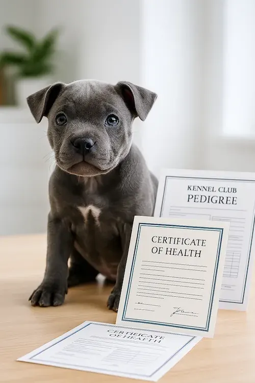

| # | Shows | File | Size | Source | Pick | Preview |
|---|---|---|---|---|---|---|
| A1-1 | Roman, our blue-and-white boy, lying on grass and looking straight at the camera. | `public/images/puppies/roman-roman1.webp` | 1080×1081 | Page's own litter (served, not on London; used only on /available-puppies/roman/) | `file:/images/puppies/roman-roman1.webp` | 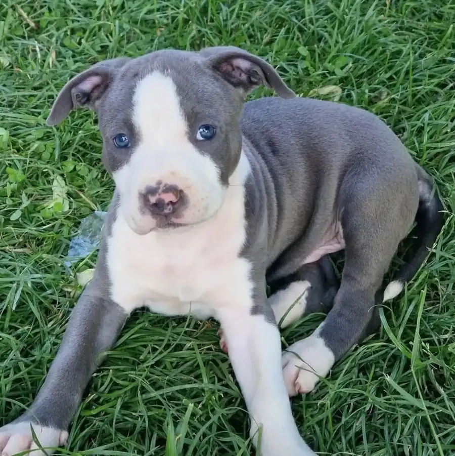 |
| A1-2 | Three blue pups wearing blue, yellow and pink ID collars, sitting on a grey sofa. | `public/images/staffordshire-bull-terrier-for-sale-uk-ready.webp` | 1080×917 | Site served, 1 sibling page (/buy-blue-staffy-puppies-uk/) | `file:/images/staffordshire-bull-terrier-for-sale-uk-ready.webp` | 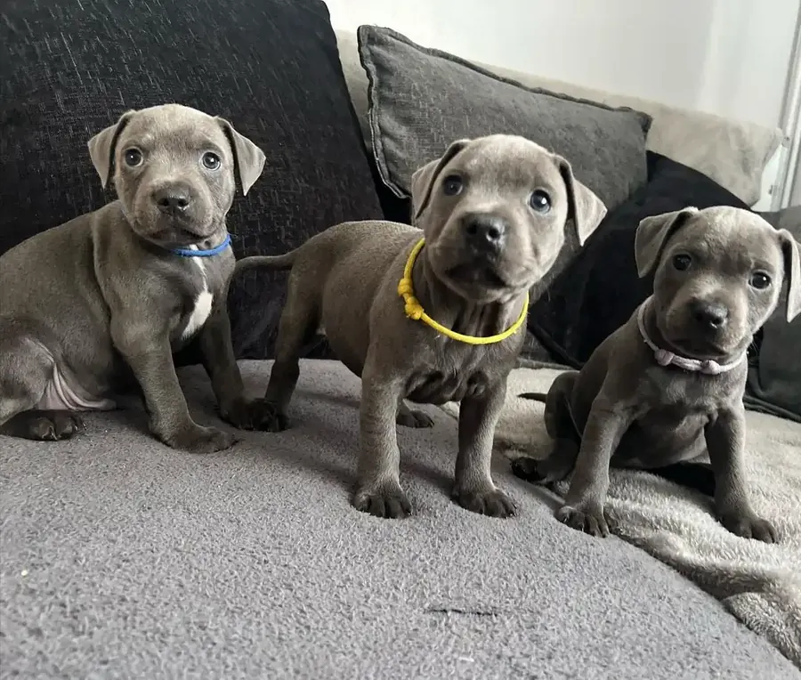 |
| A1-3 | A woman (face out of frame, sweatshirt reading "London") sits in a wire pen with five blue and blue-pied pups and toys. | `public/images/kennel-club-assured-breeder-vs-others-bluestaffyuk.webp` | 500×375 | Site served, 1 sibling page (/buy-staffy-puppies-for-sale-uk/) | `file:/images/kennel-club-assured-breeder-vs-others-bluestaffyuk.webp` | 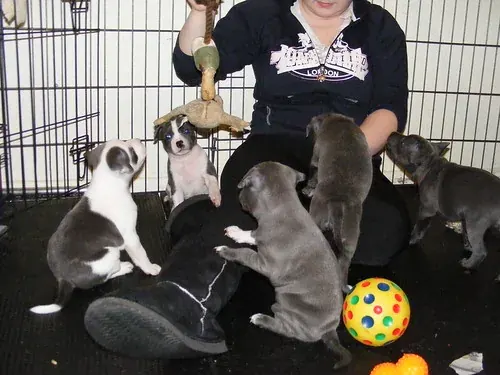 |

### A2. The van in BlueStaffyUK livery with phone digits

- **Slot:** `img:delivery-defra`
- **Where:** H2 "How Will My Blue Staffy Puppy Get From Carlisle to London?" › H3 "What Does Delivery to London Cost, and How Does My Blue Staffy Puppy Travel?" › H4 "Is the Transport DEFRA-Approved?"
- **The section says:** Yes: every delivery we book uses DEFRA-approved pet transport; the price is set by distance inside the £200–£350 band.
- **Now:** `public/images/blue-staffy-puppy-delivery-uk.webp` (1024×1024) — AI image: a blue van painted "BlueStaffyUK.uk" with a phone number, pups on a shelf above crates. 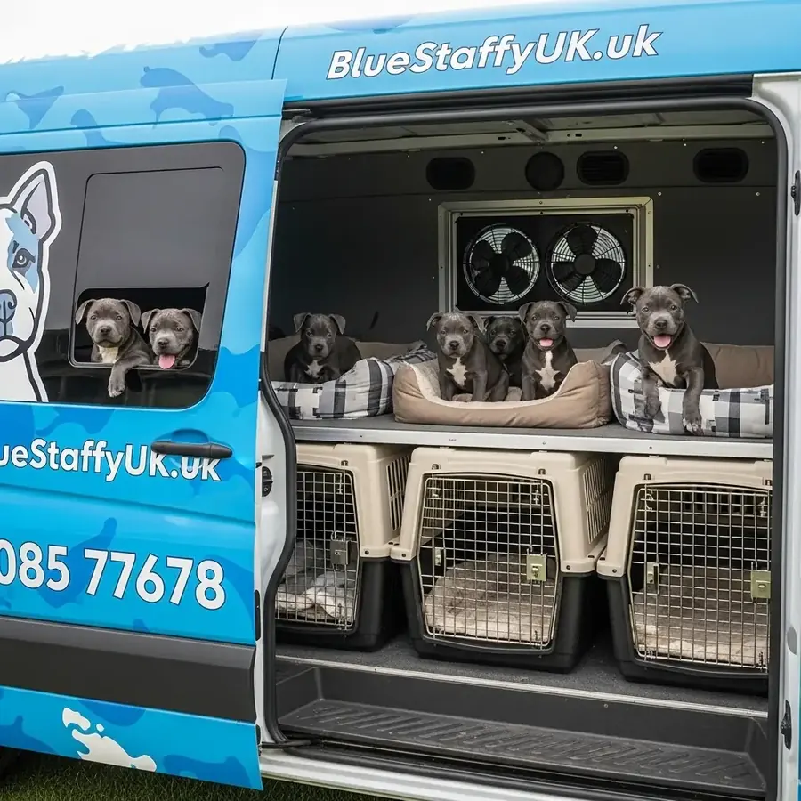

| # | Shows | File | Size | Source | Pick | Preview |
|---|---|---|---|---|---|---|
| A2-1 | Two blue pups asleep, curled together in a round bed inside a wire crate. | `public/images/blue-staffy-pups-near-you.webp` | 870×1080 | Site served, 1 sibling page (/buy-blue-staffy-puppies-uk/) | `file:/images/blue-staffy-pups-near-you.webp` | 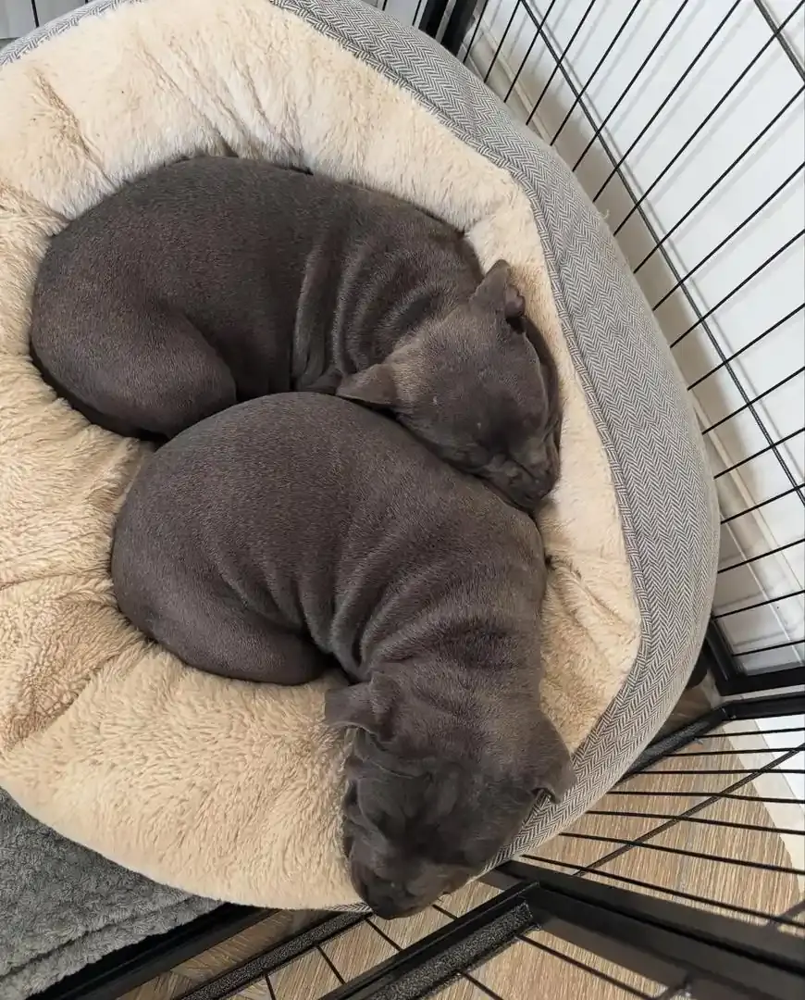 |
| A2-2 | Three blue pups in a round bed inside a wire crate, all looking up at the camera. | `public/images/uk-blue-staffy-breeders-trust.webp` | 952×1080 | Site served, 1 sibling page (/buy-blue-staffy-puppies-uk/) | `file:/images/uk-blue-staffy-breeders-trust.webp` | 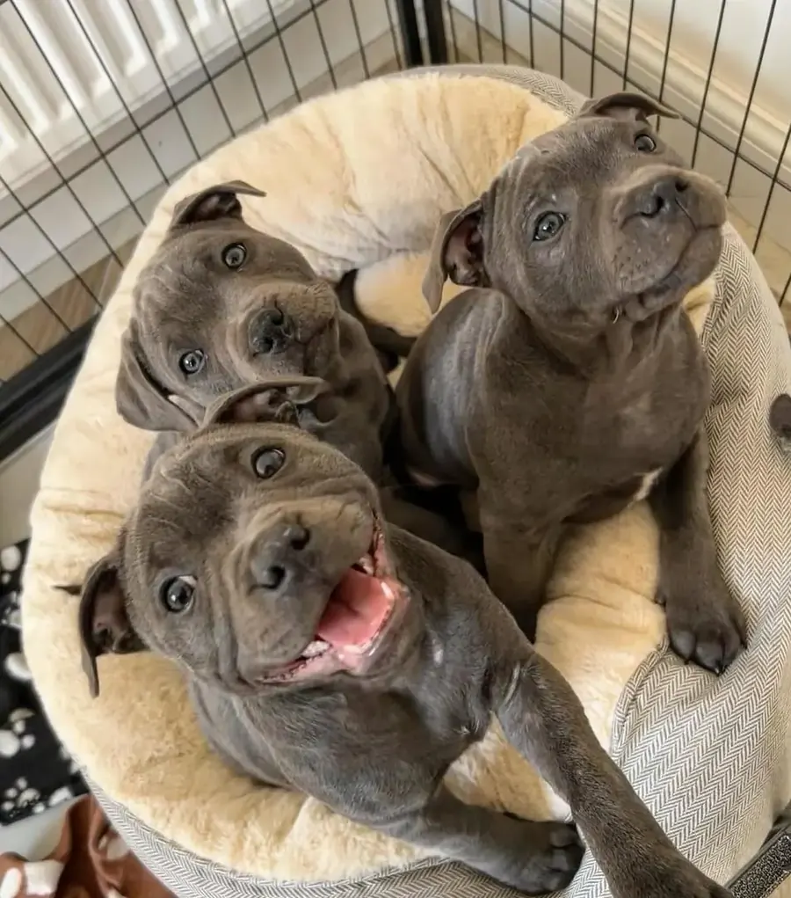 |
| A2-3 | One blue pup fast asleep, chin down on a wooden floor. | `public/images/healthy-blue-staffy-pups-for-sale-certified.webp` | 400×400 | Site served, 1 sibling page (/uk-blue-staffy-puppy-buying-guide/); low resolution | `file:/images/healthy-blue-staffy-pups-for-sale-certified.webp` | 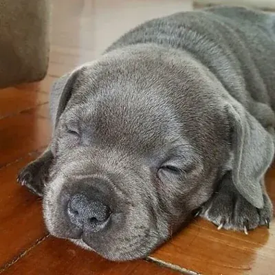 |

### A3. The "DEFRA transport partners" diagram

- **Slot:** `img:delivery-cost`
- **Where:** H2 "How Will My Blue Staffy Puppy Get From Carlisle to London?" › H3 "What Does Delivery to London Cost, and How Does My Blue Staffy Puppy Travel?"
- **The section says:** UK home delivery costs £200–£350, priced by distance, by DEFRA-approved transport; collection in Carlisle is the alternative; bring a carrier, blanket, water and a towel.
- **Now:** `public/images/defra-pet-transport-process.webp` (512×512) — AI infographic "Our Trusted DEFRA-Approved Pet Transport Partners": a blue Staffy ringed by icons with gibberish labels. 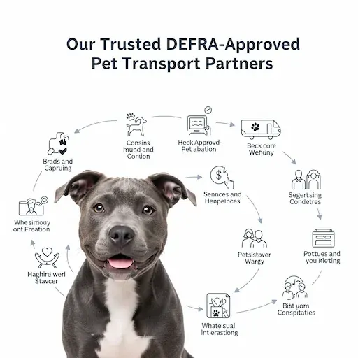

| # | Shows | File | Size | Source | Pick | Preview |
|---|---|---|---|---|---|---|
| A3-1 | A white pup (Byrd) resting on a grey blanket at home, eyes half closed. | `~/Downloads/BSUK/bluestaffyuk-cms/Assets/Images/Byrd2.jpg` | 1080×1080 | Breeder folder; this litter's own photo (filename says Byrd); not served anywhere | `assets:Byrd2.jpg` | 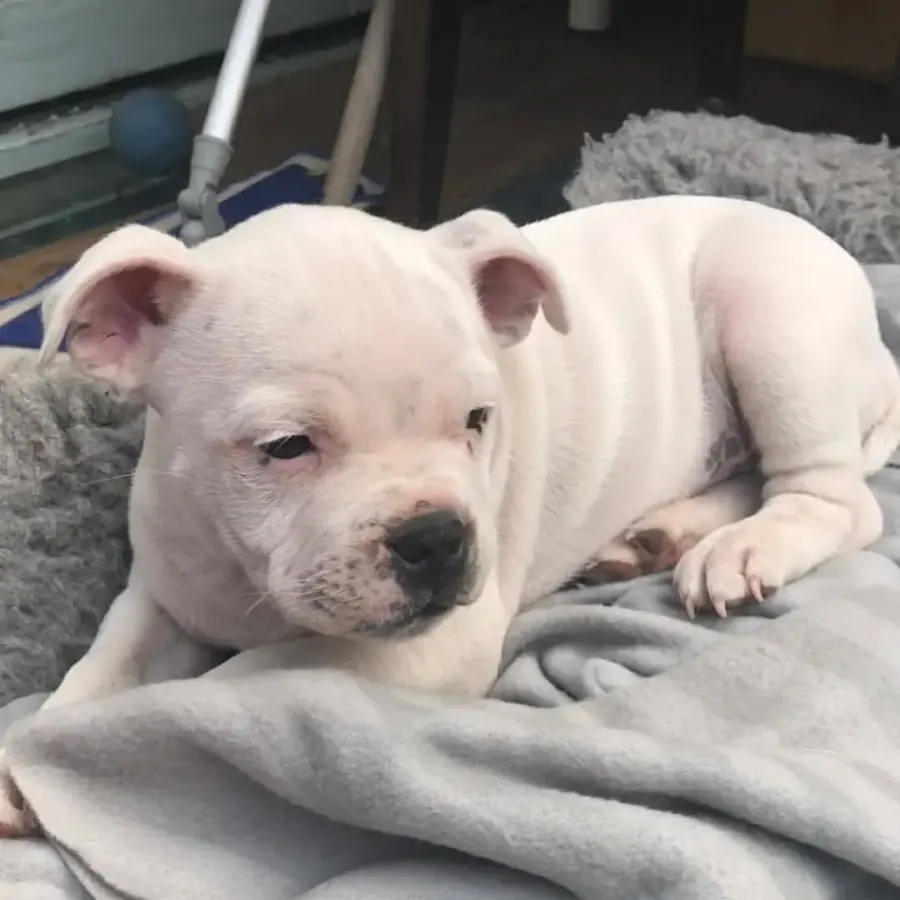 |
| A3-2 | Three blue pups in and beside a round bed, next to food bowls, a water bowl and toys on a paw-print blanket. | `public/images/buy-staffordshire-bull-terrier-uk-now.webp` | 918×602 | Site served, 2 sibling pages (/blue-staffy-pup-sale-uk/, /buy-blue-staffy-puppies-uk/) | `file:/images/buy-staffordshire-bull-terrier-uk-now.webp` | 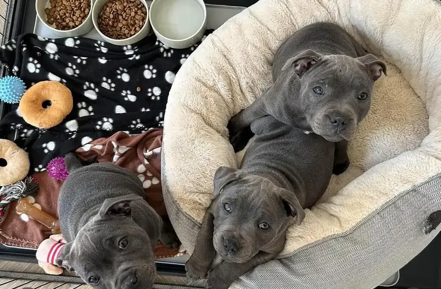 |
| A3-3 | A very young blue pup, eyes half open, held up under the chin by a hand. | `public/images/bluestaffyuk-puppy-delivery-cornwall.webp` | 400×293 | Site served, 1 sibling page (/uk-locations/blue-staffy-puppies-uk/); low resolution | `file:/images/bluestaffyuk-puppy-delivery-cornwall.webp` | 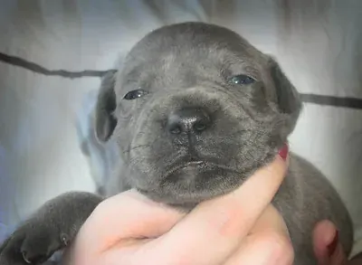 |

### A4. The "BlueStaffyUK vs Classified Ads" chart

- **Slot:** `img:litter-counter`
- **Where:** H2 "Which Blue Staffy Puppies Are Available Now, and What Do They Cost?" › H3 "How Much Is Each Blue Staffy Puppy in This Litter?" › H4 "Why Won't You Find a Cheap Blue Staffy Puppy on Our Page?"
- **The section says:** Our price is the price (£1,500 a boy, £1,700 a girl); it pays for named parents, a home-raised litter, the paperwork and the guarantee; a far lower price is a reason to ask more questions.
- **Now:** `public/images/affordable-vs-premium-blue-staffy-breeders-comparison.webp` (512×468) — AI chart "Comparing BlueStaffyUK vs. Classified Ads": cartoon pups and gibberish bullet text. 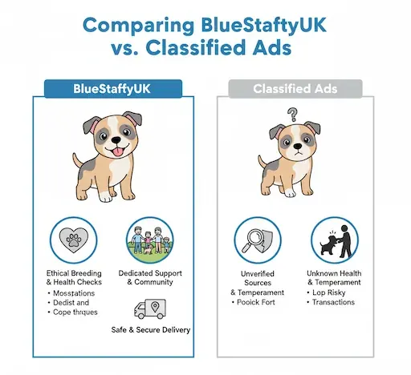

| # | Shows | File | Size | Source | Pick | Preview |
|---|---|---|---|---|---|---|
| A4-1 | Two blue pups sitting together on a paving slab at the edge of a lawn. | `public/images/buy-staffy-puppies-for-sale-uk-bluestaffyuk.webp` | 500×375 | Site served, 1 sibling page (/buy-staffy-puppies-for-sale-uk/) | `file:/images/buy-staffy-puppies-for-sale-uk-bluestaffyuk.webp` | 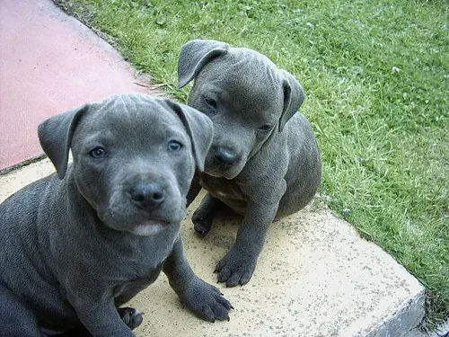 |
| A4-2 | Three young blue and blue-pied pups exploring a whelping pen with a green rug and a loose plastic sheet. | `public/images/kc-staffy-puppies-for-rehoming-uk.webp` | 640×427 | Site served, 1 sibling page (homepage) | `file:/images/kc-staffy-puppies-for-rehoming-uk.webp` | 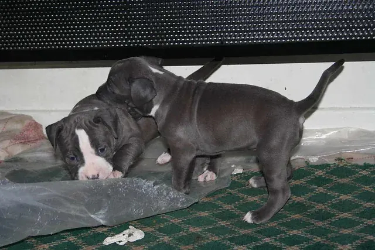 |
| A4-3 | A blue pup with a white chest patch, sitting on a white backdrop and taking a treat from a hand. | `public/images/blue-staffy-bully-puppies-for-sale-uk-kc-certified.webp` | 500×500 | Site served, 1 sibling page (/buy-staffy-puppies-for-sale-uk/) | `file:/images/blue-staffy-bully-puppies-for-sale-uk-kc-certified.webp` | 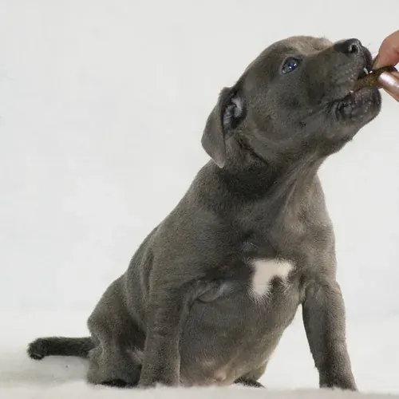 |

### A5. The "Myths vs Facts" chart

- **Slot:** `img:temperament-h2`
- **Where:** H2 "Are Blue Staffies Aggressive, or Just Very Attached to Their People?"
- **The section says:** Attached, not aggressive: a well-socialised Staffy is a devoted family dog; the usual problems in young ones come from boredom and too little training.
- **Now:** `public/images/busting-common-staffy-myths-loving-family-dog.webp` (512×469) — AI chart "Staffy Myths vs. Facts: Dispelling Common Miscosesptions": cartoon dogs and misspelt text. 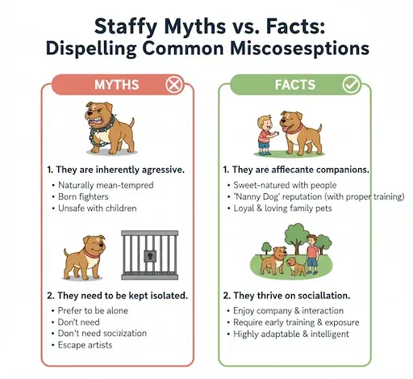

| # | Shows | File | Size | Source | Pick | Preview |
|---|---|---|---|---|---|---|
| A5-1 | A blue pup with a white blaze resting its chin on someone's lap while a hand strokes its back. | `public/images/trusted-uk-breeders-blue-staffy-family.webp` | 450×450 | Site served, 1 sibling page (/blue-staffy-uk-breeders/); also on the old About page | `file:/images/trusted-uk-breeders-blue-staffy-family.webp` | 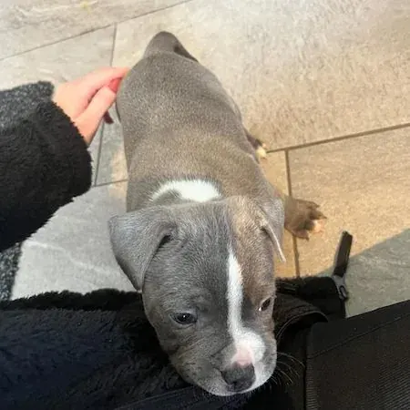 |
| A5-2 | A blue pup fast asleep belly-up across a man's lap on a sofa. | `public/images/blue-staffy-puppy-testimonial-cardiff-daniel.webp` | 640×480 | Site served, 1 sibling page (/buy-blue-staffy-puppies-uk/) | `file:/images/blue-staffy-puppy-testimonial-cardiff-daniel.webp` | 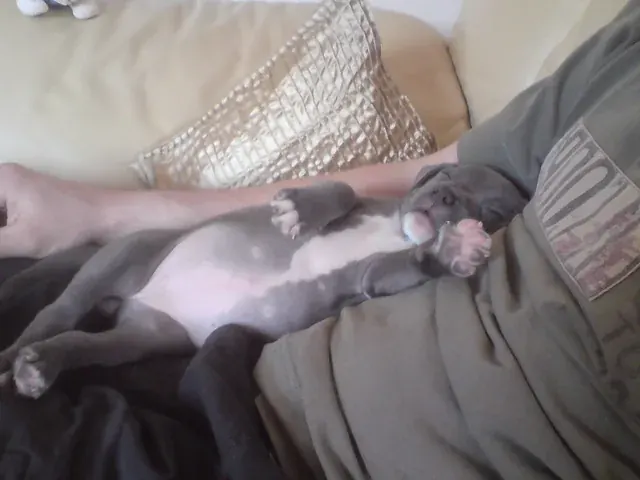 |
| A5-3 | A young woman in a red cardigan kneeling on grass while a blue pup stands up to her hands. | `public/images/reputable-blue-staffy-breeder-manchester-pup.webp` | 540×541 | Site served, 1 sibling page (/uk-locations/blue-staffy-puppies-uk/) | `file:/images/reputable-blue-staffy-breeder-manchester-pup.webp` | 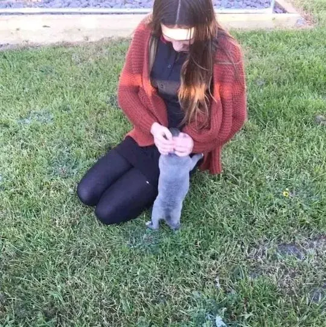 |

### Notes on Section A

- No real photograph of a van, a pet-transport vehicle or a puppy in transit exists in any source searched (the page record, public/images/, the breeder's Assets/Images/ folder, the old WordPress uploads). Slots 2 and 3 therefore offer crate, bed and handling photos; a real transport photo would have to come from the breeder.
- The page's own unused images are few: the old London page carried no images at all (logo only), and the only litter photos not shown on London are Roman1 (served on Roman's own page) and Byrd2 (breeder folder, never served).
- Working rule 11: a reused served file keeps its served alt on first use. Several candidates' served alts name another place or person: A3-3 ("The Davies Family in Cornwall"), A5-2 ("Smiling Daniel from Cardiff … testimonial quote displayed", and no quote is in the picture), A5-3 ("at home in Manchester"). That wording would need recording on the board if it changes.
- Low resolution against the 1408×768 in-body box: A2-3 (400px), A3-3 (400px), A5-1 (450px). Every candidate is a real photograph; no infographic, AI image or picture with text in it is proposed.
- Not in scope, but also AI-made on the London page: find-health-certified-staffy-breeders-uk.webp (a vet injecting a puppy, under H2 "What Should a Health Tested Staffy Breeder Show You Before You Buy?").

## B. The Breeder's Real Photo

- Filename search (case-insensitive: amel, amal, shan, sharn, shar, shen, sharon) over public/images/, ~/Downloads/BSUK/bluestaffyuk-cms/Assets/ (recursive, including the simply-static WordPress export zip), every other folder under ~/Downloads/BSUK (node_modules, dist and .git excluded), ~/Pictures, ~/Desktop, ~/Documents and the old WordPress site at ~/bluestaffyuk-site: **no image file carries any of those names.** (The only "shar" hits are test fixtures named "…shares-edge.html".)
- Text search found the name instead: the old site calls the owner **"Sharine Amelia"** (homepage info box, About page, and an About testimonial), and the old /uk-locations/blue-staffy-puppies-uk/ page captions one photo "Sharine Amelia — Owner" (B1) and one "Jeremy — Partner" (B2).
- Old About page (/blue-staffy-uk-breeders/, ~/bluestaffyuk-site/blue-staffy-uk-breeders/index.html) carried 11 content images. With a person visible: B2, B3, B4, B5. No person: blue-staffy-family-dog-uk, blue-staffy-pup-near-me-available, blue-staffy-puppy-uk-sale, bluestaffyuk-nationwide-delivery (AI van), playful-blue-staffy-lawn-uk, tan-white-staffy-puppy-uk, white-grey-staffy-puppy-uk. Only B2 shows a face.
- Flag for the breeder: the rebuild names the breeder Lisa Bright (data/settings.json); the old site named the owner Sharine Amelia. Which name and which photo go on the page is the breeder's call.

| # | Shows | File | Size | Context | Preview |
|---|---|---|---|---|---|
| B1 | A woman with glasses and her hair in a bun, face visible and smiling, holding a fawn pup and a dark brindle pup. | `public/images/dedicated-blue-staffy-pup-care-glasgow.webp (old: /wp-content/uploads/dedicated-blue-staffy-pup-care-glasgow.jpg)` | 640×360 | Captioned "Sharine Amelia / Owner" on the old /uk-locations/blue-staffy-puppies-uk/ page. The same name signs the old homepage ("Hi, I Am Sharine Amelia") and the old About page ("I am Sharine Amelia…"). Served today on 3 rebuilt pages. | 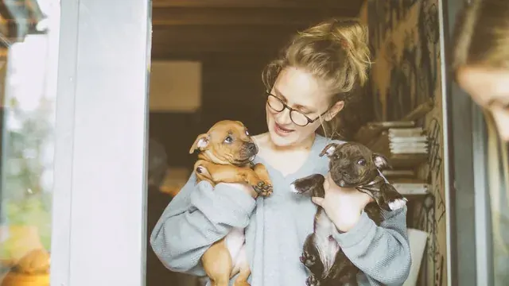 |
| B2 | A bearded man in a grey hoodie, face in profile, kissing a fawn pup; a second person is cut off at the right edge. | `public/images/family-friendly-blue-staffy-glasgow.webp (old: /wp-content/uploads/family-friendly-blue-staffy-glasgow.jpg)` | 640×360 | On the old About page, and captioned "Jeremy / Partner" on the old /uk-locations/blue-staffy-puppies-uk/ page. | 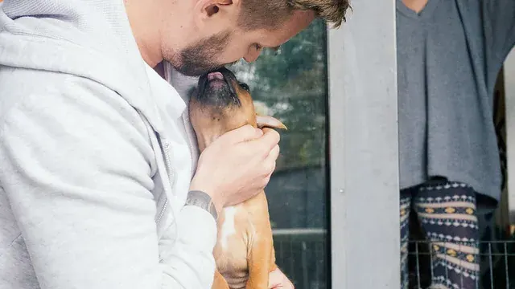 |
| B3 | A blue pup on a person's lap in a living room; only a ringed hand, black cardigan sleeve and legs show, no face. | `public/images/breeder-sitting-blue-staffy-puppy-home.webp (old: /wp-content/uploads/breeder-sitting-blue-staffy-puppy-home.jpg)` | 640×480 | On the old About page; its old alt reads "A breeder holding a blue Staffy puppy, smiling". Already shown on the London page. | 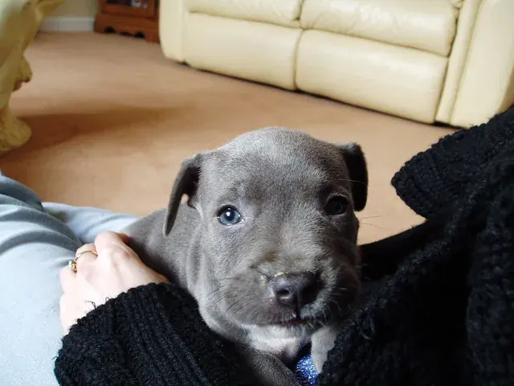 |
| B4 | A person in a purple T-shirt with tattooed forearms holding a brindle pup up to the camera; no face. | `public/images/testimonial-david-southampton-staffy-pup.webp (old: /wp-content/uploads/testimonial-david-southampton-staffy-pup.jpg)` | 450×450 | On the old About page, labelled as a customer ("David, a new owner from Southampton"). | 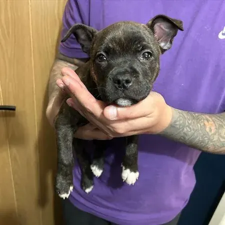 |
| B5 | A hand in a black sleeve stroking a blue pup resting on a lap; no face. | `public/images/trusted-uk-breeders-blue-staffy-family.webp (old: /wp-content/uploads/trusted-uk-breeders-blue-staffy-family.jpg)` | 450×450 | On the old About page (also candidate A5-1). |  |
| B6 | A woman sitting in a wire puppy pen with five pups; her face is cropped off, her sweatshirt reads "London". | `public/images/kennel-club-assured-breeder-vs-others-bluestaffyuk.webp` | 500×375 | Not on the old About page; found in the site's served images. Its served alt calls her "A breeder". Also candidate A1-3. |  |
| B7 | A young woman with long dark hair, face partly visible and looking down, kneeling on grass with a blue pup. | `public/images/reputable-blue-staffy-breeder-manchester-pup.webp` | 540×541 | Not on the old About page; found in the site's served images. Its served alt describes a Manchester owner. Also candidate A5-3. |  |

## C. Puppy Personality Lines

Searched: data/puppies.json (no description field), the six built pages dist/available-puppies/<slug>/ (each carries only "Enquire about <name>"), src/, data/ (boards, outlines, research boards, page runs, faq, reviews, settings), docs/ (specs, plans, research, answer board), the old WordPress site ~/bluestaffyuk-site (none of Vennie, Christa or Byrd appears anywhere in it; it had no /available-puppies/ pages), the WordPress export zips, and the CMS folder ~/Downloads/BSUK/bluestaffyuk-cms (its admin config.yml defines a puppy "Description" field, but no data file fills it). The only per-pup words anywhere are photo alts, which describe the picture, not the dog.

| Puppy | Coat and sex (data/puppies.json) | Existing personality description | Source |
|---|---|---|---|
| Roman | Blue and white boy | NONE FOUND | — |
| Byrd | White boy | NONE FOUND | — |
| Ince | Blue boy | NONE FOUND | — |
| Vennie | Blue and white girl | NONE FOUND | — |
| Christa | Blue girl | NONE FOUND | — |
| Cheryl | Blue with white blaze girl | NONE FOUND | — |

No line has been written for any puppy. Each one needs the breeder's own words.
