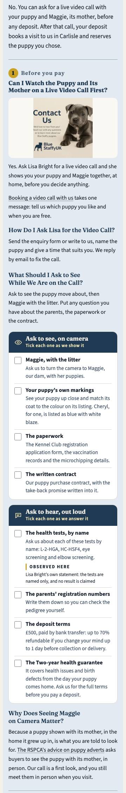
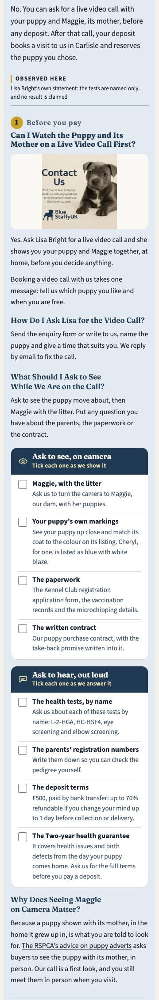
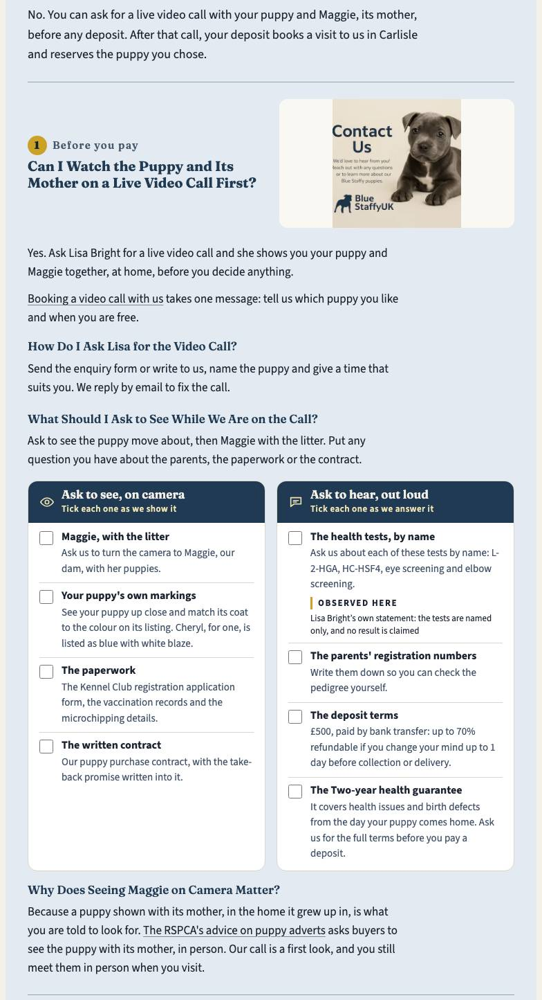
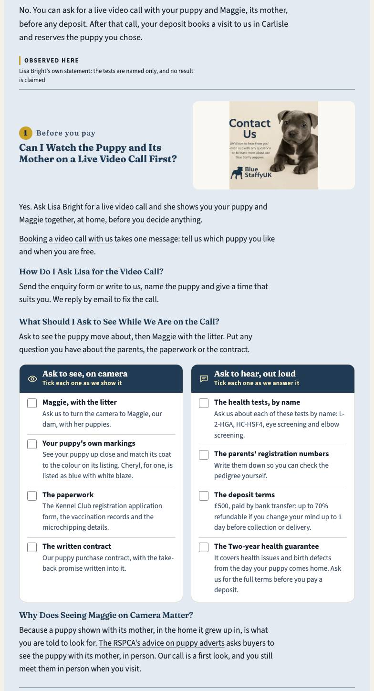
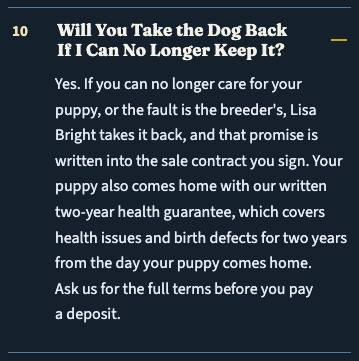
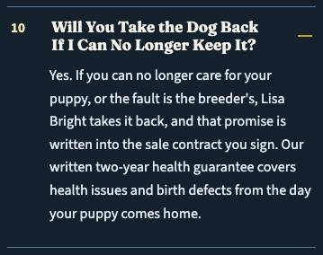
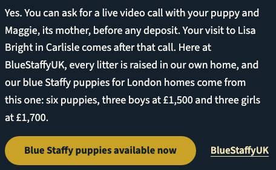
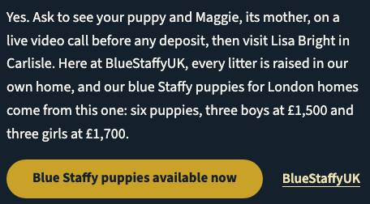

# Certificates and London Tweaks

The breeder ruled that the parents' certificates and DNA results are shared on request and kept off the website. This page proposes that ruling, in fresh words, for ten more pages, and London's four last render fixes, each measured on a copy of the built site.

## What This Page Holds

Two pieces of proposal work for the breeder, measured on a copy of the built site. Nothing in `src/`, `data/` or the boards has changed.

- **Part A.** Her chat ruling of 2026-10-05: the parents' health certificates and DNA test results exist, are shared with a buyer on request after contact, and stay off the website so they cannot be copied. She asked for the same two facts on the ten other rebuilt pages that name the tests, worded differently on each. Below are ten new sentences, one per page, plus London's as built. Each is placed where its page already talks about the tests. Seven lines now contradict the ruling and need a correction. On the buy page the new sentence itself replaces one of them. Three more imply the DNA tests have no paperwork behind them, and those edits are optional.
- **Part B.** London's three city render failures and one stale FAQ intro. All three failures were confirmed on the copy first. Each card gives the options, what they measured and one **(Recommended)** pick.

| Check | Result |
|---|---|
| 5-word runs shared between the 11 versions (and the 9 corrected lines) | **0** |
| 5-word runs a version shares with any other built page (51 pages, before injection) | **0** |
| Dup-gate logic at 5 words, after injection: runs that touch the new text | **0** |
| Dup gate at its own 12 words, after injection | 130 → 130 findings, 0 new, 0 gone (the 130 are the migrated-city baseline) |
| Evidence audit, 11 pages | 0 ERROR before, after and with the proposed ledger row. WARN 179 → 180 → 179 |
| City type-fit on London with every Part B pick applied | **0 defects** at 375 / 768 / 1024 / 1280 (examined 316 / 267 / 265 / 313) |
| AEO pronoun ratio on London, all picks applied | 0.0184 (built 0.0188; the limit is 0.02) |

**Not a result claim anywhere.** No version says clear, passed, a grade or a score. The test's own `result_lines()` flags 2 of the 10 new sentences: health and contact, which use the words "DNA results" and "DNA and health certificates". Each needs an exact-sentence `RULED` entry, the same treatment London's sentence already has.

## Part A · The Certificates Sentence, Page by Page

Each sentence is written from its own page's angle: the homepage from Maggie and Jones by name, the health page from the table it owns, the breeders page from its "no third test" paragraph, the money page from cost, the buying guide from the litter, the breed guide from "the paper itself", the hub from its archive, and the contact page from the form. Every one is first person, carries both facts (shared after contact, kept off the site so it cannot be copied or reused) and states no result. Lines were checked by reading every test-naming sentence on the eleven built pages, plus every "no file we keep", "hold no" and "show you" line.

| Page | Where | New sentence | Contradicting line (old → new) | Source to edit |
|---|---|---|---|---|
| / | `#health` · H3 "The Two Tests on Maggie and Jones", after "…before you take anybody's word for it, ours included." (it names the tests: "L-2-HGA and HC-HSF4 are the two inherited conditions…") | Write to us and the certificates for Maggie and Jones are yours to read. None of that paperwork goes online, where a copy could be cloned for another seller's advert. | Optional · `#trust` "Each claim above names something real: a registration, two DNA tests we name and answer questions about, …" → "…two DNA tests whose paperwork you may ask for, …" | `src/pages/index.astro` (line 700); board `data/boards/index.json` `health` revision |
| /blue-staffy-health-uk/ | `#dna-tests` · H3 "A Test Belongs to A Dog, Not to A Kennel", after "…reporting something no one can check against a dog." (the section names L-2-HGA and HC-HSF4 in its table) | The DNA results behind that table are Maggie's and Jones's own, and we hand them to you privately once you have contacted us. They are never published, so no other breeder can borrow them as proof for a dog of theirs. | Required · `#screening` Patella Grading: "We state that we do it and print no grade, because a grade is a number and no file we keep holds one." → "We state that we do it and print no grade here." (the certificates may now be a file we keep: the breeder must confirm before a page says either way) | `src/pages/blue-staffy-health-uk/index.astro` (line 458); board `dna-tests`, `screening` revisions |
| /blue-staffy-uk-breeders/ | `#health-testing` · H3 "Two Tests Named, and No Third", after "…nowhere in our files, would be worth nothing to you." (the section opens "Both Maggie and Jones have had DNA tests for L-2-HGA and HC-HSF4…") | The real two are written up in each parent's own certificates, which every family receives after its first message and which we leave off this site so they cannot be reused. | None found | `src/pages/blue-staffy-uk-breeders/index.astro` (line 492); board `health-testing` revision |
| /buy-staffy-puppies-for-sale-uk/ | `#questions` · FAQ "Which Health Tests Have Both Parents Had?" (answer: "L-2-HGA and HC-HSF4 by DNA test, and eye and elbow screening.") | Their certificates reach you after you make contact. This page holds them back so nobody can copy them, and it states no result. | Required · the same FAQ: "We hold no DNA certificates, so we name the tests and quote no result." → replaced by the new sentence. Required · `#compared` "…the tests named, and three papers you can read, rather than four descriptions." → "…the tests named and every paper open to you, rather than four descriptions." Optional · `#reasons` "…or the test we name and answer questions about." → "…or the test whose paperwork follows once you ask." Optional · FAQ "Why Should Families Choose…": "…both parents’ DNA tests, which we name and answer questions about." → "…which we name and will evidence privately." | `data/faq.json` rows `whyus-evidence` and `whyus-partner` (also the page's FAQPage JSON-LD); `src/pages/buy-staffy-puppies-for-sale-uk/index.astro` for `#compared` and `#reasons`; board `questions`, `compared`, `reasons` revisions |
| /buy-blue-staffy-puppies-uk/ | `#parents` · H3 "The Two DNA Tests Maggie and Jones Have Had", after "…screened against, L-2-HGA and HC-HSF4." | Their test papers are for buyers rather than browsers. Ask, and both dogs' papers come to you; we hold them offline so another seller cannot pass them off as theirs. | None found | `src/pages/buy-blue-staffy-puppies-uk/index.astro` (line 454); board `parents` revision |
| /blue-staffy-pup-sale-uk/ | `#why-choose` · H3 "Ethical Breeding Standards", after "Maggie and Jones have both been through the DNA tests for L-2-HGA and HC-HSF4, … Each puppy is microchipped and vet checked." | Seeing their DNA paperwork costs nothing: ask once you are in contact with us and we hand it over, though never on this page, where a stranger could copy it. | None found | `src/pages/blue-staffy-pup-sale-uk/index.astro` (line 287); board `why-choose` revision |
| /uk-blue-staffy-puppy-buying-guide/ | `#health-checks` · H3 "What Our Own Two Are Tested For", after "Both ours are DNA tested for both." | Their certificates are yours to see in private after you write, and never on this guide, since anything posted here could be pinned to some other litter. | Required (made false by the insertion) · "That is the only sentence here about our own dogs." → "Nothing else here is about our own dogs." Required · "No laboratory is named there or here: no file we keep records one." → "No laboratory is named there or here." Checked, no change · `#takeaways` "Told the parents are clear but shown no certificate, you have been told nothing you can check." is general advice and agrees with the ruling | `src/pages/uk-blue-staffy-puppy-buying-guide/index.astro` (line 881); board `health-checks` revision |
| /uk-staffordshire-bull-terrier-guide/ | `#choosing-breeder` · H3 "They Name Both Tests on Both Parents", after "Our two tests are on the health page, named against the dogs they belong to." | The paper itself is what we hold back from the internet: contact us and you can read it, but a certificate published online can be copied onto any dog. | Required · `#health` Eyes and Knees: "Neither prints a score, there or here, because a score is a number and no file we keep holds one." → "Neither prints a score, there or here." Checked, no change · "A breeder who says the parents are clear and cannot produce the paper has told you nothing at all." (we can produce the paper on request) | `src/pages/uk-staffordshire-bull-terrier-guide/index.astro` (line 1017); board `choosing-breeder`, `health` revisions |
| /blue-staffy-blog-guides/ | `#start-here` · H3 "The Health Page", after "…the two DNA tests our parent dogs have had, the vaccination course, and what the breed's life expectancy is." (the hub names "the two DNA tests" and no test by name) | No guide here carries the certificates themselves: they come to you after you write, which keeps them out of reach of anyone who would copy them. | None found | `src/pages/blue-staffy-blog-guides/index.astro` (line 409); board `start-here` revision |
| /uk-blue-staffy-breeders-contact/ | `#what-to-tell-us` · H3 "Your Message", after "…left you wondering." (the page names the tests only in the kit trust strip, which is hard-coded in `src/components/kit/TrustStrip.astro`, shared by 5 pages and whitelisted, so it is not the place) | Ask in your message to read the parents' DNA and health certificates and we will pass them on; none of them is posted here, which stops anyone cloning them. | None found | `src/pages/uk-blue-staffy-breeders-contact/index.astro` (line 324); board `what-to-tell-us` revision |
| London (built, for reference) | `#health-tests` · after "A health tested Staffy breeder names each parent's tests: …" | We share the parents' health certificates and DNA test results with you directly when you get in touch. We keep them off the website so they can't be copied or passed off as someone else's. | Required · twice: FAQ "Are the Puppy's Parents Health Tested?" (`#faq-middle`) and H3 "What Are L-2-HGA and HC-HSF4…" (`#health-tests`): "We hold no certificates, so we name the tests and quote no result." → "We name the tests and quote no result." (this line sits in the same section as the ruled sentence and contradicts it directly) | `src/pages/uk-locations/blue-staffy-puppies-london.astro` lines 341 and 612; board revision 35 |

**Why some lines are "required".** London's and the buy page's "We hold no … certificates" now say the opposite of the ruling. The buying guide's "the only sentence here about our own dogs" becomes false once a second sentence about our dogs sits beside it. The three "no file we keep holds one" lines, on the lab, the grade and the score, assert that no document of ours holds that detail. A DNA certificate usually names its laboratory, and an eye or patella certificate may hold a grade, so the safe fix drops the reason and keeps the "no grade / no score / no laboratory here" statement. Whether the certificates hold any of these is the breeder's to confirm (rule 9), and the rewording is right either way.

## Part A · Duplicate Crossover, Simulated

Method: `npm run -s build` once. `dist/` was copied to a scratch directory and each sentence was injected into its page's built HTML (as a replacement where noted). Every comparison then ran on the copy with `scripts/dup_content_audit.py`'s own code: its `words()` tokeniser and chrome skipping, its `shingles()` and `crossovers()`, and its whitelist.

| Check | Examined | Hits |
|---|---|---|
| 5-word runs shared between any two of the 11 versions and 9 corrected lines (190 pairs) | 20 texts | **0** |
| Each version's 5-word runs against every other built page, gate tokeniser | 51 pages | **0** |
| The same, against the full visible text (nav, footer and chrome included) | 51 pages | **0** |
| Dup-gate `crossovers()` at 5 words on the injected copy, runs touching injected text | 1,275 page pairs | **0** |
| `dup_content_audit.py` at its 12 words, body | 51 pages | 130 → 130 (0 new, 0 gone) |
| `dup_content_audit.py --headers` | 51 pages | 11 → 11 (no heading touched) |

Three drafts collided on the way, and each was reworded until the count reached 0. The homepage and buying guide shared "where a copy could be". The breeders page used "the two that are real", which the health page already prints. The health page shared "once you have contacted us" with the buy page and "to you privately once you" with the buying guide. The London correction "We name the tests and quote no result." shares 4 runs with the buy page's old FAQ line, which Part A replaces, so the injected copy shows 0.

**Claim checks on the same copy.** `tests/py/test_no_health_result_stated.py`'s `result_lines()` on each page, before and after: new hits only on health ("The DNA results behind that table…") and contact ("…DNA and health certificates…"). Both need an exact-sentence `RULED` entry. The other eight carry no health word next to "certificates" and raise nothing. The buy page's FAQ row passes `test_no_faq_row_states_a_result` with no entry. `evidence_audit.py` over the 11 pages: 0 ERROR throughout. The only new WARN is contact's `health-tested` vocabulary ("health certificates"), and the proposed ledger row below clears it.

## Part A · What Else Applying It Touches

- **Boards (rule 6, 12).** Each of the ten records gets a `board_revisions` row in London's form: source `answer board 2026-10-05-chat-certificates-on-request q01`, the section ids in the table, and the sentence word for word in `decision`. Then `python3 scripts/board_approve.py <slug> --reapprove --reason "…"`. No section, pick, figure or link changes, which is the diff `--reapprove` accepts. London's correction becomes its revision 35. None of the ten records has a `board_revisions` list yet, so each row is its first.
- **Rule 15 (verbatim set).** No anchor or corrected line is in `data/verbatim/<slug>.json`: each was checked by text. The buy page's FAQ question is verbatim, but only its answer changes. The contact page predates rule 15.
- **Rule 1 (voice).** All ten are first person. The contact page itself says "lets me" in places; its sentence keeps "we", like the rest of the site.
- **Ledger row `certificates-on-request` (one row covers all eleven).** Today's pattern is London's first sentence only, and it does not reach the full stop, so ", and both came back clear." appended to it would still match. Proposed: `pattern` becomes an alternation of the eleven sentences, each word for word to its full stop, behind a guard that refuses a clause before it. `covers` stays `["dna-test", "health-tested"]` (never `dna-clear`), and `proof`, `confirmed` and `anchor` stay. Simulated: each sentence is matched once on its own page and nowhere else on 51 pages. Up to six result variants per sentence went unmatched: a "Clear:" prefix, "clear" inserted, ", and both came back clear." and ", all of them passed." appended, and "Tested clear." before it. London's existing refusal set in `tests/py/test_evidence_certificates_on_request.py` still holds. Contact's WARN clears (evidence WARN back to 179). A page that printed its sentence twice would WARN under `claim_binding`, because the proof is not linked on the page, and that is the guard wanted. The full row is in `ledger-row-proposed.json` beside this page.
- **Tests.** `tests/py/test_no_health_result_stated.py` `RULED` needs two more exact sentences, for health and contact, each citing the ruling file. Its `test_the_ledger_row_records_that_no_certificate_is_held` pins `parents-dna-clear`'s barrier text "no DNA certificates", which the ruling has overtaken. Propose rewording the barrier to "held but not on file in the repository: shared with a buyer on request (chat ruling 2026-10-05); no page states a result", keeping proof `NOT FETCHED`, and updating the assertion. A new test should hold each of the eleven sentences on its page, and each page to one.
- **Stale comments (housekeeping, not rendered).** The header comment of `src/pages/blue-staffy-health-uk/index.astro` ("the breeder holds no DNA certificates"), `src/components/kit/InfoCard.astro` line 38, and the docstring of `tests/py/test_no_health_result_stated.py`.
- **What stays.** The "Observed here" labels ("the tests are named only, and no result is claimed") stay true. The kit trust strip is not touched.

Proposed pattern (JSON string, 2,177 bytes):

```
(?<![\w,;:'’-] )(?<![\w,;:'’-])(?:We\s+share\s+the\s+parents(?:'|’)\s+health\s+certificates\s+and\s+DNA\s+test\s+results\s+with\s+you\s+directly\s+when\s+you\s+get\s+in\s+touch\.|Write\s+to\s+us\s+and\s+the\s+certificates\s+for\s+Maggie\s+and\s+Jones\s+are\s+yours\s+to\s+read\.|The\s+DNA\s+results\s+behind\s+that\s+table\s+are\s+Maggie(?:'|’)s\s+and\s+Jones(?:'|’)s\s+own,\s+and\s+we\s+hand\s+them\s+to\s+you\s+privately\s+once\s+you\s+have\s+contacted\s+us\.|The\s+real\s+two\s+are\s+written\s+up\s+in\s+each\s+parent(?:'|’)s\s+own\s+certificates,\s+which\s+every\s+family\s+receives\s+after\s+its\s+first\s+message\s+and\s+which\s+we\s+leave\s+off\s+this\s+site\s+so\s+they\s+cannot\s+be\s+reused\.|Their\s+certificates\s+reach\s+you\s+after\s+you\s+make\s+contact\.|Their\s+test\s+papers\s+are\s+for\s+buyers\s+rather\s+than\s+browsers\.|Seeing\s+their\s+DNA\s+paperwork\s+costs\s+nothing:\s+ask\s+once\s+you\s+are\s+in\s+contact\s+with\s+us\s+and\s+we\s+hand\s+it\s+over,\s+though\s+never\s+on\s+this\s+page,\s+where\s+a\s+stranger\s+could\s+copy\s+it\.|Their\s+certificates\s+are\s+yours\s+to\s+see\s+in\s+private\s+after\s+you\s+write,\s+and\s+never\s+on\s+this\s+guide,\s+since\s+anything\s+posted\s+here\s+could\s+be\s+pinned\s+to\s+some\s+other\s+litter\.|The\s+paper\s+itself\s+is\s+what\s+we\s+hold\s+back\s+from\s+the\s+internet:\s+contact\s+us\s+and\s+you\s+can\s+read\s+it,\s+but\s+a\s+certificate\s+published\s+online\s+can\s+be\s+copied\s+onto\s+any\s+dog\.|No\s+guide\s+here\s+carries\s+the\s+certificates\s+themselves:\s+they\s+come\s+to\s+you\s+after\s+you\s+write,\s+which\s+keeps\s+them\s+out\s+of\s+reach\s+of\s+anyone\s+who\s+would\s+copy\s+them\.|Ask\s+in\s+your\s+message\s+to\s+read\s+the\s+parents(?:'|’)\s+DNA\s+and\s+health\s+certificates\s+and\s+we\s+will\s+pass\s+them\s+on;\s+none\s+of\s+them\s+is\s+posted\s+here,\s+which\s+stops\s+anyone\s+cloning\s+them\.)
```

## Part B · 1 · The Video-Call Answer Is Over the Height Cap

**Confirmed on the copy.** The answer "Can I Watch the Puppy and Its Mother on a Live Video Call First?" (`#deposit-viewing`, chapter 1) measures **2,069px at 375** against a cap of 2,030 (2.5 × 812), and **1,318px at 1280** against 1,280 (1.6 × 800). The "Observed here" line under "The health tests, by name" in the listen pane is 59px tall, plus 6px of margin. At 1280 the listen pane sets the height of both panes (563px each).

| Option (visual only) | 375 answer | 1280 answer | Passes? |
|---|---|---|---|
| Built | 2,069 | 1,318 | No (+39, +38) |
| A · label moved onto the listen pane's header line | 2,067 | 1,316 | No: the header grows by what the item lost |
| **B · label moved into the chapter frame, after the lede (Recommended)** | **2,004** | **1,254** | **Yes, 26px under at both** |
| C · label word only for this section (note dropped) | 2,028 | 1,278 | By 2px; also drops approved words |
| D · label as one line under both panes | 2,073 | 1,322 | No: it still wraps to 3 lines at 65ch |

With B the frame is 770px at 375 (cap 2,030) and 937px at 1280 (cap 1,280), well inside its own cap. Full city type-fit on that copy: 1 defect at 375 (the take-back paragraph, item 2), 0 at 768, 1 at 1024 (the hero lede, item 3), 0 at 1280.

**Why B.** It is the only option that clears both widths with room, and it keeps the label's words exactly as approved (q02 (a)). It needs no component change: `CityChapters` already takes `ledeLabel={{ ...TESTS_NAMED, where: 'after' }}`, the prop London's `#health-tests` chapter uses with `'before'`. The edit is two lines in `src/pages/uk-locations/blue-staffy-puppies-london.astro`: drop `stmt: TESTS_NAMED` from the checklist item (line 277), and add `ledeLabel` to the `#deposit-viewing` mount (line 471). The section keeps its label, so `statement-labels-present` holds. **Trade-off:** the label now reads as the chapter's statement, above answer 1, rather than sitting beside "The health tests, by name". The headroom is 26px, so a sentence added to that answer later would bring the failure back.






## Part B · 2 · The Take-Back Answer Runs 10 Lines at 375

**Confirmed on the copy.** "Will You Take the Dog Back If I Can No Longer Keep It?" is 71 words and runs **10 lines at 375** (limit 8), and 6 at 768, 1024 and 1280 (limit 8, 6, 6). It also says the guarantee's length twice ("two-year … for two years"), the double that review M1 removed from the homepage.

| Option | Words | 375 | 768 | 1024 | 1280 |
|---|---|---|---|---|---|
| Built | 71 | 10 ✗ | 6 | 6 | 6 |
| T1 · label only: "…written into the sale contract you sign. Your puppy also comes home with our written two-year health guarantee." | 43 | 6 | 4 | 4 | 4 |
| T2 · label and note: "…written into the sale contract you sign. It sits beside our written two-year health guarantee. Ask us for the full terms before you pay a deposit." | 50 | 7 | 4 | 4 | 4 |
| **T3 · label and cover (Recommended)** | **50** | **7** | **5** | **5** | **5** |

**T3, in full:** "Yes. If you can no longer care for your puppy, or the fault is the breeder's, Lisa Bright takes it back, and that promise is written into the sale contract you sign. Our written two-year health guarantee covers health issues and birth defects from the day your puppy comes home."

Source: the `faqBottom` row at line 348 of the London astro, with the second sentence read through `coverSentenceOf(G, \`Our written ${GUARANTEE_LOWER}\`)` from `src/lib/guarantee.ts`. That puts the label from `guarantee_label` and the cover from `guarantee_cover` with its length taken out, so the length is said once. Nothing is typed by hand. The cover clause is the whitelisted dup stem. `test_the_built_take_back_sentences_name_the_written_contract` still finds "written into the sale contract" in its window. **Why T3:** it keeps every fact except the deposit note and fixes the double length. **Trade-off:** it drops "Ask us for the full terms before you pay a deposit." here (the checklist's guarantee item still carries it), and at 375 it has one line of room (the seventh line is 49% full). T1 has more room but drops what the guarantee covers.




## Part B · 3 · The Hero Lede Is 7 Lines at 1024

**Confirmed on the copy.** The hero lede (`.city-hero-filmstrip`, 64 words) runs **7 lines at 1024** (limit 6). It is 8 at 375, exactly at that limit.

| Option | Words | 375 | 768 | 1024 | 1280 | Pronoun ratio (page) | Brand mentions |
|---|---|---|---|---|---|---|---|
| Built (swap #2) | 64 | 8 | 5 | 7 ✗ | 5 | 0.0188 | 8 |
| L1 · revert swap #2 to "We raise every litter in our own home, …" | 61 | 7 | 5 | 6 (54% of line 6 used) | 5 | 0.0190 | 7 |
| L2 · keep the brand; "Yes. Ask for a live video call … before any deposit; your visit to Lisa Bright in Carlisle comes after it." | 61 | 7 | 5 | 6 (58%) | 5 | 0.0188 | 8 |
| **L3 · keep the brand; merge the first two sentences (Recommended)** | **58** | **7** | **5** | **6 (34%)** | **5** | **0.0188** | **8** |

**L3, in full:** "Yes. Ask to see your puppy and Maggie, its mother, on a live video call before any deposit, then visit Lisa Bright in Carlisle. Here at BlueStaffyUK, every litter is raised in our own home, and our blue Staffy puppies for London homes come from this one: six puppies, three boys at £1,500 and three girls at £1,700." The counts and prices stay interpolated from data, as now (line 422 of the London astro).

Pronoun ratios come from `scripts/aeo_audit.py`'s own `PRONOUNS` and `entity_report()` over London's built HTML with each lede swapped in. Every option stays under 0.02 and none reads as pronoun-heavy. **Why L3:** it keeps "Here at BlueStaffyUK" (swap #2's purpose) and every fact: the call on request, Maggie, before any deposit, the visit to Lisa Bright in Carlisle, the home-raised litter, the keyword phrase, the counts and the prices. It leaves the most room at 1024 and 19% of line 7 free at 375. **Trade-off:** "Your visit … comes after that call" becomes "then visit", which reads more as an instruction. No option reaches 5 lines at 1024 without dropping the brand or the keyword phrase, so the room is part of one line.




## Part B · 4 · The Bottom FAQ Intro Still Lists Children

**Confirmed.** `#faq-bottom` ("What Do London Buyers Ask About Living With a Staffy?") carries the lede "Flats, first dogs, children, training and coat colour." (London astro line 760). Its seven questions are now: 13 first-time owner (puppy or rescue), 14 house dog, 15 male or female, 16 behavioural issues, 17 socialisation, 18 a London flat, 19 how rare blue is. No question is about children.

| Option | Matches |
|---|---|
| "Flats, first dogs, training and coat colour." | Q18, Q13, Q16 (in part) and Q19. Silent on 14, 15 and 17 |
| **"First dogs, house life, boy or girl, behaviour, socialising, flats and coat colour." (Recommended)** | **One topic per question, in the block's order, Q13 to Q19** |

**Why:** a reader scanning the intro sees every question the block answers, and nothing it does not. **Trade-off:** 12 words instead of 7: 2 lines at 375, 1 line at 768, 1024 and 1280, inside the caps at every width (type-fit 0 defects with all picks applied). It shares no 12-word run with any page.

## How This Was Measured

- `npm run -s build` once (exit 0). `dist/` was copied to the session scratch directory and served with `python3 -m http.server`. The repository's `dist/`, `src/`, `data/` and boards were not touched.
- Part A: sentences were injected into the copied HTML by a script. The checks imported `scripts/dup_content_audit.py`, `scripts/evidence_audit.py` and `tests/py/test_no_health_result_stated.py` and ran their own functions. `dup_content_audit.py` and `evidence_audit.py` also ran from the command line with `--dist` on the copy. `crossover.json` beside this page is the raw output.
- Part B: Playwright Chromium at 375×812, 768×1024, 1024×768 and 1280×800, the harness's viewports. Every height and line count comes from `tests/render/lib/cityTypeFit.ts` itself (transpiled with esbuild and run in the page), plus a probe using the same line-counting method. Options were applied to the live DOM. The all-picks copy (lede L3, answer T3, intro, London's Part A correction) was written into a second dist copy, and `aeo_audit.py`, `evidence_audit.py` and `dup_content_audit.py` ran there: AEO clean (0 WARN), evidence 0 ERROR / 0 WARN, dup 130 → 130 with 0 new.
- Screenshots: full page, every image decoded, clipped to the element, FAQ answers opened.
