# London Close Proposals

/uk-locations/blue-staffy-puppies-london/ · 2026-10-05

London's final gate run left nine copied FAQ questions, seven sections without a statement label and a page that says "we" more than it names anyone. The breeder has ruled on all three. This page shows each proposal before it touches the site, with the gate counts it produces.

## What This Page Holds

The breeder answered the London gate-findings batch on 2026-10-05 (`docs/reference/answer-board/answers/2026-10-05-london-gate-findings-2026-10-05.md`). Three picks are applied and committed. Four need her approval before anything reaches the page, and each is previewed here on a copy of the built site.

| Pick | Her answer | State |
|---|---|---|
| q03 term budget | (a) record London's counts as its own limit, tune the location limits before the next city | **Applied** `39ebabb0`: London's budget entry (blue staffy 32, staffy puppies 22, Staffordshire Bull Terrier 10, London 60, UK 20) is a ratchet; Known Issue 99 calibrates the location ceilings |
| q04 tests named four times | (a) the check accepts the repeats under her ruling | **Applied** `86a7cc45`: the evidence check skips repeats of a naming-only ledger row under a ruling; a repeated result claim still warns |
| q07 the binomial | (a) add it | **Applied** `07229fcf`: "The Staffordshire Bull Terrier is a breed of domestic dog, *Canis lupus familiaris*." opens the breed section's first chapter |
| q01 copied FAQ questions | (b) no duplicates; questions from London's research only | **Proposal below**: 8 replacements, 1 drop |
| q02 answer openings | (a) use the three | Folded into the q01 proposal (two openings reused inside replacements, the guarantee built from its data fields) |
| q05 statement labels | (b) labels on all five sections | **Preview below** (seven sections now: q07 and q06 add two) |
| q06 lifespan label | (a) preview it | **Preview below** |
| q08 we/our/us | (a) show the 21 swaps first | **List below** |

## What the Three Proposals Do to the Gates

Each column is the built London page with that proposal injected into a copy of `dist/`, then run through the same audits `gate:page` runs. Nothing in `src/` changed.

| Measure | Built page now | FAQ set (q01) | 21 swaps (q08) | Labels (q05, q06) | All three |
|---|---|---|---|---|---|
| Duplicate body runs naming London | 5 | 0 | 5 | 5 | **0** |
| Duplicate headings naming London | 12 | 0 | 12 | 12 | **0** |
| AEO WARNs | 2 (pronoun-heavy; no stat-bearing header) | 1 (pronoun-heavy) | 1 (no stat-bearing header) | 2 (pronoun-heavy; no stat-bearing header) | **0** |
| Evidence audit | 0 ERROR / 7 WARN | 0 ERROR / 7 WARN | 0 ERROR / 7 WARN | 0 ERROR / 0 WARN | **0 ERROR / 0 WARN** |
| we/our/us ÷ words | 141 ÷ 6,016 = 0.0234 | 139 ÷ 6,233 = 0.0223 | 120 ÷ 6,036 = 0.0199 | 141 ÷ 6,112 = 0.0231 | **118 ÷ 6,349 = 0.0186** |
| Named entities (binomial, Lisa Bright, Carlisle/Cumbria, credentials) | 66 | 71 | 81 | 71 | **91** |
| "blue staffy" / London / UK / BlueStaffyUK (budget 32 / 60 / 20 / 10) | 32 / 60 / 20 / 5 | 28 / 60 / 20 / 4 | 32 / 60 / 20 / 9 | 32 / 60 / 20 / 5 | **28 / 60 / 20 / 8** |
| Final audit · hardening · outline provenance | PASS · 0 ERROR · 0 | PASS · 0 ERROR · 0 | PASS · 0 ERROR · 0 | PASS · 0 ERROR · 0 | **PASS · 0 ERROR · 0** |

The pronoun WARN fires when we/our/us run above 2% of the page's words **and** outnumber the named entities. The AEO "no stat-bearing header" WARN clears through the FAQ set, because one new question carries the £500 figure. With all three applied, every page audit `gate:page` runs is clean on London. "staffy puppies" stays at 22 and Staffordshire Bull Terrier at 10 in every column.

## q01 · The Nine Copied FAQ Questions

Her ruling: no duplicate FAQs; use questions from the London page's own research (People Also Ask, Reddit or Quora long-form questions, useful ones the site does not already carry), or keep only the London page's non-duplicate questions. Each replacement below passed three tests:

1. **Not on the website.** It matches no heading on any of the 51 built pages, exactly, with the breed swapped, or by a shared five-word run (`scripts/pageboard.py` `header_precheck`, the board's own collision test). Of the question file's 70 questions that come from the site's own FAQ bank, 66 fail it.
2. **Answerable from our files only.** Every fact is in `data/` or an answer-board ruling, cited per row. No answer states a test result, a licence or a price that is not read from data.
3. **Sourced.** The query's origin and record path are given. Where the source wording was trimmed, the row says what and why.

Recommended: the eight replacements and one drop below, in the city-free wording. Each "London" added to a question goes over the q03 ratchet (60) and would need that entry re-measured.

| # | Block | Old question (duplicate) | New question | Source | Proposed answer | Facts from |
|---|---|---|---|---|---|---|
| 1 | bottom | Are Blue Staffies Good Family Pets, Especially With Children? | **Drop** | — | No research question on children or family is free of the site: PAA, the Reddit and AskUK threads, Google's related searches and the ChatGPT answer ask none, and every question-file row on the topic (home-family-children, guide-children-pets) is already a heading on / or /uk-staffordshire-bull-terrier-guide/. The nanny-dog fact stays on the page in 'Is a Staffy a Good House Dog?'. | — |
| 2 | bottom | Are Blue Staffies Suitable for First-Time Dog Owners? | **As a First-Time Owner, Should I Get a Staffy Puppy or an Adult Rescue?** | Reddit r/UK_Pets, 'Reputable Staffordshire Bull Terrier breeders UK' (thread 1sdvsvv), extracted question; data/queries/raw/blue-staffy-puppies-london/threads.json (not carried into the question file's 87 rows) | That choice is yours; Lisa Bright breeds puppies, so this answer speaks for that side only. A puppy suits a first-time owner if your household has the time to give: early socialising, steady reward-based training and company matter more than experience. Each litter here starts that socialising indoors at home in Carlisle before it leaves. (55 words) | data/faq.json listing-first-time-owners (time to give, socialisation, training) answer board 2026-10-05 london-gate-findings q02 (a): the approved first-time opening answer board 2026-10-04 london-visual-intel q08: every litter raised in our home |
| 3 | bottom | Are Staffies Hard to Train? | **What Are Common Staffie Behavioural Issues?** | Google People Also Ask for 'blue staffy puppies london' (spelled 'behavioral' there; UK spelling here); data/queries/raw/blue-staffy-puppies-london/serp_google.json, question-file row q-what-are-common-staffy-behavioral-issues-3 | Most are the flip side of a strong, people-focused dog. Staffies are strong-willed, so they need consistent training from a young age; some have a prey drive, so early socialising with other animals matters; and they do not cope with being left alone for long stretches. Short, regular training sessions work better than long ones. (55 words) | data/faq.json guide-downsides (strong-willed, consistent training, prey drive, early socialisation with other animals) data/faq.json listing-left-alone (not for long stretches, people-focused) data/faq.json listing-training + London's own answer (short, regular sessions) |
| 4 | bottom | Are the Puppies Raised in a Family Home or in Kennels? | **What Socialisation Has the Puppy Received?** | ChatGPT's buyer question for 'Where can I buy a blue Staffy puppy near London, and what should I ask the breeder?' ('What food is it currently eating, and what socialisation has it received?' — the socialisation half; no food fact is on file); data/queries/raw/blue-staffy-puppies-london/ai_engines.response.json | Socialising at home, never in kennels. Every litter grows up indoors with us in our family home in Carlisle, among the everyday sights and sounds of a house, and follows both Puppy Culture and early neurological stimulation. (37 words) | answer board 2026-10-05 london-gate-findings q02 (a): the approved raised-at-home opening answer board 2026-10-04 london-visual-intel q08: litters raised in our home, never kennels answer board 2026-09-24 follow-up Q16: both Puppy Culture and ENS data/settings.json address.city |
| 5 | middle | Can I Visit You Before I Decide? | **How Do I Find a Reputable, Health-Tested Staffy Breeder?** | Reddit r/UK_Pets, thread 1sdvsvv; question-file row q-how-do-i-find-a-reputable-health-tested-12 ('…in the UK?' — the last three words are dropped because 'UK' is at its ratchet budget, 20) | Start with two asks: which tests the parents have had, and a look at the puppy with its mother before you pay. Ask Lisa Bright and she names four for Maggie and Jones: L-2-HGA, HC-HSF4, eye screening and elbow screening, with no result quoted. Then visit by appointment at the family home in Carlisle where Maggie and Jones live. (59 words) | answer board 2026-09-29 q01: name the four tests, never a result answer board 2026-09-29 q03: live video call with the puppy and its mother data/faq.json contact-visit: visits by appointment only, family home data/settings.json address.city |
| 6 | middle | Do You Offer Health Guarantees for Your Blue Staffy Puppies? | **Will You Take the Dog Back If I Can No Longer Keep It?** | ChatGPT's buyer question ('Will you take the dog back or help rehome it if I can no longer keep it?' — the rehoming half dropped: no fact on file); data/queries/raw/blue-staffy-puppies-london/ai_engines.response.json | Yes. If you can no longer care for your puppy, or the fault is the breeder's, Lisa Bright takes it back, and that promise is written into the sale contract you sign. Your puppy also comes home with our written two-year health guarantee, which covers health issues and birth defects for two years from the day your puppy comes home. Ask us for the full terms before you pay a deposit. (71 words) | answer board 2026-09-24 follow-up Q6: taken back if the fault is the breeder's or the owner can no longer care for it answer board 2026-09-29 q05: the take-back promise is in the written contract data/settings.json guarantee_label, guarantee_cover, guarantee_note (q02/q07 2026-09-29) |
| 7 | top | How Do I Know a Puppy Is Still Available? | **Is There a Waiting List for a Well-Bred Staffy Puppy?** | Reddit r/UK_Pets, thread 1sdvsvv; question-file row q-is-there-a-waiting-list-for-a-well-ae9f94 | Not for this litter: all six puppies on the list are still available, so you reserve straight from it. Tell us which one you like and we confirm it is still free before you pay anything. For the next litter, leave your email in the newsletter box for a note when it is on the way. (56 words) | data/puppies.json: six rows, status Available (count read at build, never typed) data/faq.json listing-availability + London's own answer: we confirm before you pay the page's newsletter section (#newsletter): 'we write when our next litter is on the way' |
| 8 | top | How Much Is the Deposit? | **Can I Buy a Staffy for Under £500?** | Google 'People also search for' under the AI Overview for 'blue staffy puppies london': 'Staffy puppies for sale London under 500'; docs/research/london-page-run/aio-google-2026-09-30.md | Not from us. Ours are £1,500 for a boy and £1,700 for a girl, wherever you live. £500 is our deposit, not the price: you pay it by bank transfer after the video call, it books your viewing and reserves your puppy, and it comes off the £1,500 or £1,700. (50 words) | data/puppies.json / data/price-matrix.json: £1,500 boys, £1,700 girls data/settings.json deposit_gbp 500; src/lib/cityKit.ts depositBrief answer board 2026-09-29 q04: deposit by bank transfer answer board 2026-09-29 q03: video call on request |
| 9 | middle | What Is Included When I Buy a Blue Staffy Puppy From BlueStaffyUK? | **What Has a Puppy Had Before It Comes Home?** | London question file row q-what-has-a-puppy-had-before-it-comes-46de4 (a data/faq.json bank question, health-vaccinations, that no built page shows as a heading); ChatGPT asks the same ('What vaccinations, microchip and worming has it had?') | Ours have had a veterinary health check, first vaccinations, a microchip, worming and flea treatment, each recorded on a vet-signed health card that travels with the puppy. The Kennel Club registration application form comes too, so you register your puppy in your own name, with a puppy pack to help it settle. (52 words) | data/settings.json puppy_trust_signs (answer board 2026-10-04 q06, q07) data/quality/evidence-ledger.json parents-kc-registered-application-form basis (q06: the buyer registers the pup) data/faq.json puppy-package (a puppy pack) |

**Why #1 is dropped, not replaced:** no research question on children or family is free of the site, and the template forbids padding a block with an invented or reworded duplicate. **Why "Can I Buy a Staffy for Under £500?" is recommended for #8:** it is a real London search, it keeps the deposit in the top block, and its £500 figure clears the AEO "no stat-bearing header" WARN. Its trade-off is that a "cheap" question sits on a premium page; the answer turns it into the price and deposit facts.

**The q02 openings.** No duplicated question is kept, so no answer needs them in their original place. The raised-at-home opening's words carry #4 ("…never in kennels. Every litter grows up indoors with us…"), the first-time opening's words carry #2, and #6 builds the guarantee from `guarantee_label`, `guarantee_cover` and `guarantee_note` in `data/settings.json`.

**Block counts after the change:** top 5 (range 5 to 7), middle 7 (5 to 7), bottom 7 (7 to 10): **19 questions** (the gate's band is 15 to 20). The new answers are longer than the ones they replace (40 to 71 words against 12 to 40), so the FAQ blocks grow from 170 / 294 / 263 to 239 / 403 / 320 words. That is above the board's FAQ word bands (171 to 209, 194 to 237, 194 to 237). The old blocks already ran over the middle and bottom bands. The 40 to 80 word answer length was the brief's.

**Checked on a copy of `dist/` with the set in place:** London's duplicate headings 12 → 0, duplicate body runs 5 → 0, final audit PASS, hardening 0 ERROR (Title Case included), outline provenance 0, every term inside the q03 budget.

### Alternates

| Slot | Question | Source | Answer | Note |
|---|---|---|---|---|
| 7 | Is It Safe to Pay a Deposit to a Seller I Found Through an Online Advert? | Reddit r/UK_Pets, 'pets4homesuk' (thread 1uil782); question-file row q-is-it-safe-to-pay-a-deposit-to-6c495b | Not until you have seen the puppy with its mother on a live video call and can check who the seller is. That is how we work: ask for the call with your puppy and Maggie first, and only then pay the £500 deposit by bank transfer; it reserves your puppy and comes off the price. | Overlaps the middle block's 'Should I See My Puppy With Its Mother Before Any Money Changes Hands?' |
| 9 | How Can I Be Sure a Puppy's Kennel Club Registration Will Be Issued If the Papers Are Delayed? | Reddit r/AskUK, 'Buying puppy in UK, are we getting scammed?' (thread 1okt0wb); question-file row q-how-can-i-be-sure-a-puppy-kennel-fb1d6b | With us there is nothing to wait for: your puppy comes home with its Kennel Club registration application form, so you register it in your own name once it is home. Ask us for both parents' registration numbers too, and check the pedigree with the Kennel Club yourself. | Also answers Google's related search 'blue staffy puppies london kennel club'; 'If' is capitalised for Title Case |
| 8 | Can I Buy a Staffy in London for Under £500? | the same related search, London kept | (same answer as the recommended row) | +1 'London' (city 60 -> 61): the q03 ratchet entry would be re-measured |
| 5 | How Do I Find a Reputable, Health-Tested Staffy Breeder From London? | the same thread, London version | (same answer as the recommended row) | +1 'London' (city ratchet 60) |

Both alternates also simulate to 0 duplicate headings and 0 duplicate body runs.

### What applying it changes

- `src/pages/uk-locations/blue-staffy-puppies-london.astro`: the eight FAQ rows and one removed row. Prices, the deposit, the puppy count and the guarantee clause are read from data, never typed. The FAQPage schema follows the visible rows.
- `data/boards/blue-staffy-puppies-london.json`: the FAQ blocks' `Q:` tree intents, a `board_revisions` entry citing the rulings file, then `board_approve.py --reapprove`.
- `data/queries/blue-staffy-puppies-london.json`: `covered_by` on the eight source rows, because the page refuses to build a question the file does not cover. The Reddit first-time question and the two ChatGPT questions need rows of their own.
- `data/quality/evidence-ledger.json`: `litters-home-raised-never-kennels` matches the old answer's words, which leave the page. Its pattern moves to the new sentence. It covers no vocabulary, so no gate changes.

## q05 and q06 · Statement Labels

The evidence audit wants a statement label in any section whose text names a health or species fact: `HC` (as in HC-HSF4), L-2-HGA, PHPV, a lifespan, `12 to 14 years`, the binomial. The test is whether the section contains `class="stmt-label"`. The site's label is the kit's: ``, with three kinds and their fixed words in `src/lib/statement.ts`: **Fact**, **Observed here** and **Our recommendation**. The render check `sem-statement-label-visible` requires each label to be painted and to carry one of those three kinds. Built pages carry 150 Fact labels, 2 Observed here and 2 Our recommendation. No London section has one yet.

The q07 binomial sentence makes **#breed** a seventh flagged section, so the plan covers seven.

| Section | The sentence that triggers it | Proposed label | Why this kind |
|---|---|---|---|
| #trust | The tests, named: L-2-HGA, HC-HSF4, eye screening and elbow screening; no result quoted | **Observed here** · Lisa Bright’s own statement: the tests are named only, and no result is claimed | Names the tests and states no result. The site already labels test naming this way on /blue-staffy-health-uk/ ("Five Named, and No Numbers"). |
| #key-takeaways | Ask any breeder, us included, about L-2-HGA, HC-HSF4, eye screening and elbow screening. | **Observed here** · Lisa Bright’s own statement: the tests are named only, and no result is claimed | Names the tests and states no result. The site already labels test naming this way on /blue-staffy-health-uk/ ("Five Named, and No Numbers"). |
| #deposit-viewing | The health tests, by name: Ask us about each of these tests by name: L-2-HGA, HC-HSF4… | **Observed here** · Lisa Bright’s own statement: the tests are named only, and no result is claimed | Names the tests and states no result. The site already labels test naming this way on /blue-staffy-health-uk/ ("Five Named, and No Numbers"). |
| #faq-middle | Ask us about L-2-HGA, HC-HSF4, eye screening and elbow screening for Maggie and Jones. | **Observed here** · Lisa Bright’s own statement: the tests are named only, and no result is claimed | Names the tests and states no result. The site already labels test naming this way on /blue-staffy-health-uk/ ("Five Named, and No Numbers"). |
| #health-tests | A health tested Staffy breeder names each parent's tests: L-2-HGA, HC-HSF4… | **Observed here** · Lisa Bright’s own statement: the tests are named only, and no result is claimed | Names the tests and states no result. The site already labels test naming this way on /blue-staffy-health-uk/ ("Five Named, and No Numbers"). |
| #breed | The Staffordshire Bull Terrier is a breed of domestic dog, Canis lupus familiaris. (q07) | **Fact** · Breed taxonomy | Taxonomy is a breed fact; rules/copy.md allows the neutral register for it. |
| #everyday-health | A Staffy lives 12 to 14 years with good care and good genetics. | **Fact** · Breed lifespan, 12 to 14 years · source: the Purina breed library | The guide's approved Lifespan cell, cited to the Purina breed library (q06 asked for "Breed fact · source: Purina"). |

**Recommended:** "Observed here" on the five test-naming sections, with the note "Lisa Bright's own statement: the tests are named only, and no result is claimed". The trade-off is the same note repeated five times. Two alternatives: (b) "Our recommendation" on #key-takeaways and #deposit-viewing, which are "ask" lines; that adds two "our" to the pronoun count. (c) The label word alone with no note; shorter, but then nothing on the label says that no result is claimed.

**Never next to a naming sentence.** Each label is its own line. If the word "result" shared a sentence with one of the four naming sentences in #health-tests, the q04 check would read it as a result claim and the WARN would come back. In the simulation with all seven labels, the evidence audit gives 0 ERROR / 0 WARN.

**Contrast.** The label takes the text colour of the surface it sits on: 12.9:1 on the steel tint, 13.9:1 on bone, 15.7:1 on white, 14.6:1 on the dark FAQ band. A first try in the kit's muted ink measured 3.0:1 on the dark band and 4.49:1 on the tint, below the 4.5:1 floor, so it was changed. No label causes a horizontal scroll at 375 or 1280.

**Applying it** needs a small shared piece in `src/components/kit/` that reads its words from `src/lib/statement.ts`. No city component prints a label today. It also needs a render fixture pair, the seven placements in the London page, and a board revision. The preview below is CSS and HTML injected into a copy of `dist/` and served locally.

### #trust

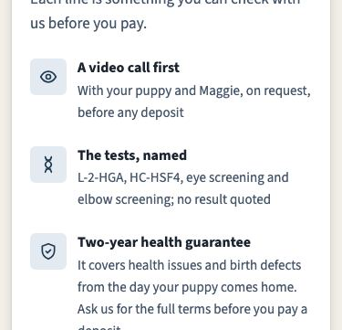
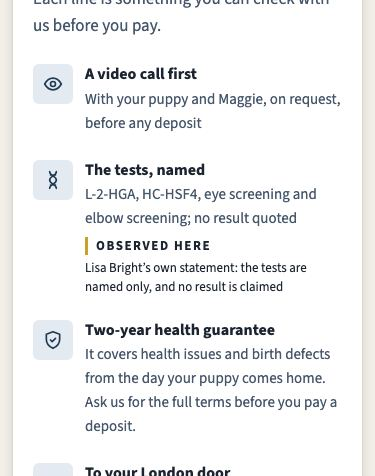
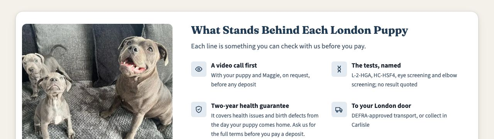
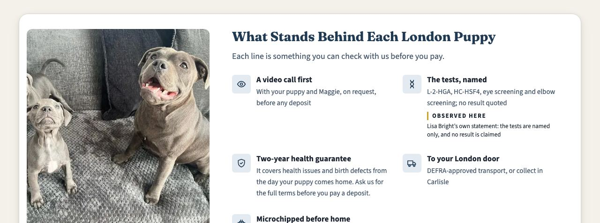

### #key-takeaways

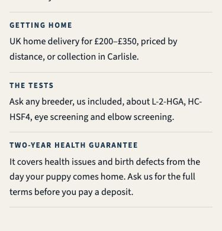
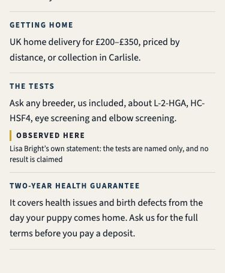
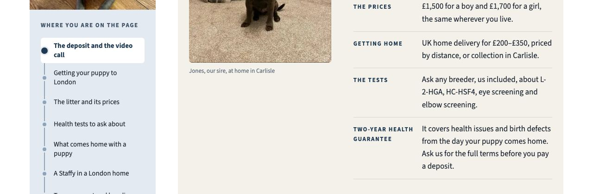
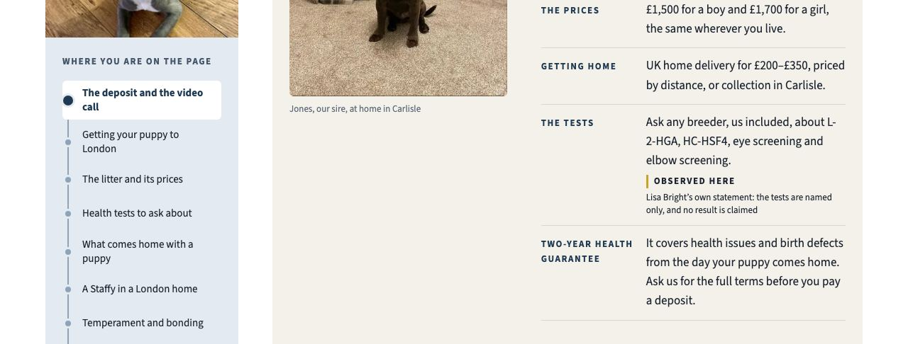

### #deposit-viewing

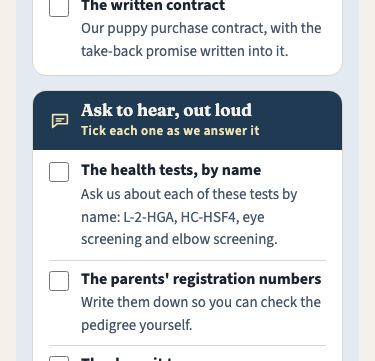
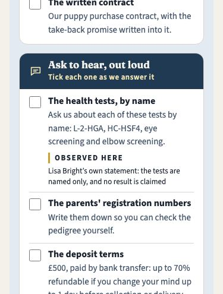
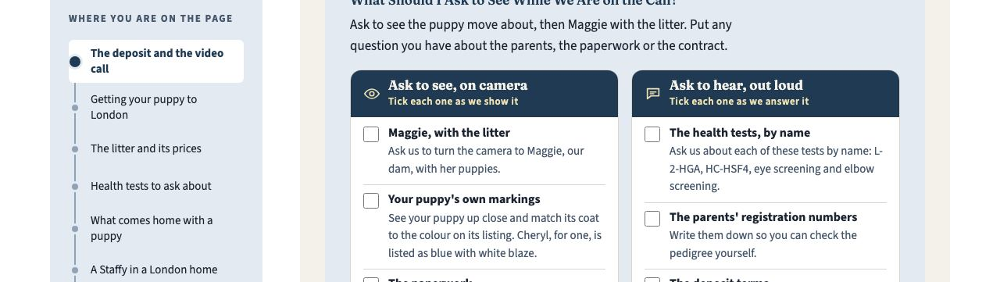
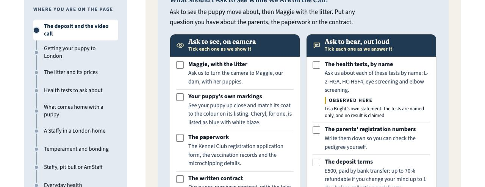

### #faq-middle

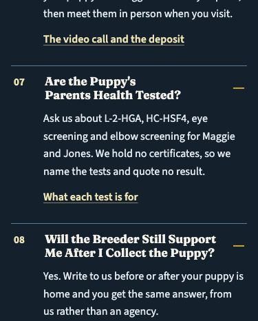
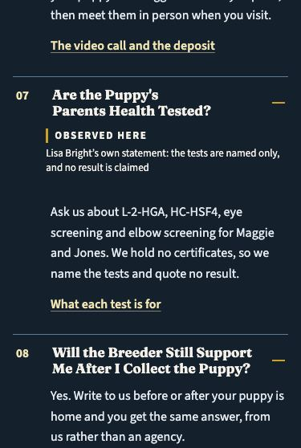
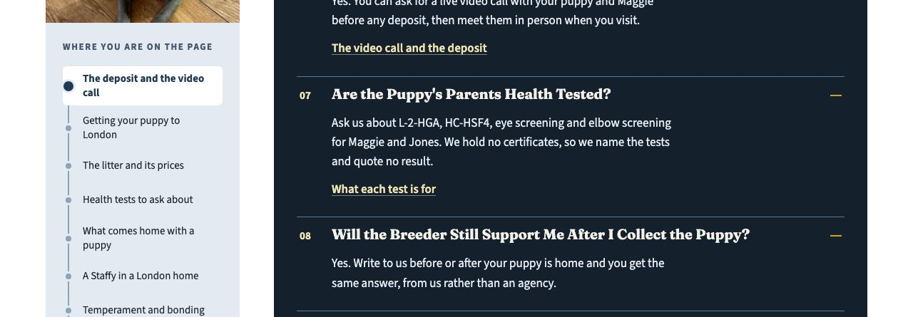
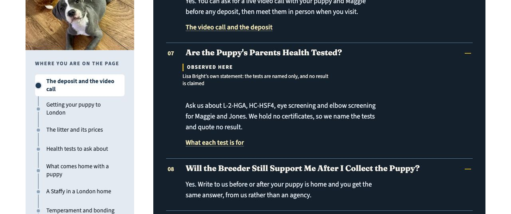

### #health-tests

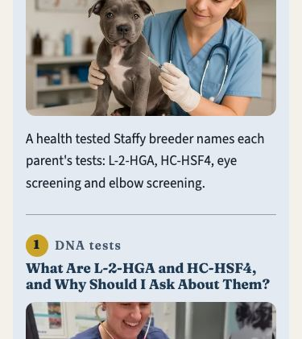
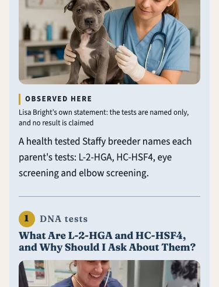
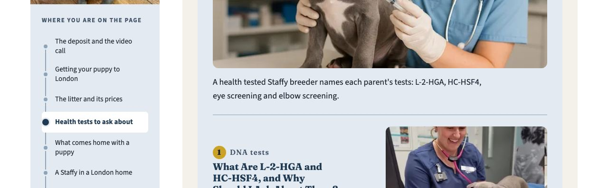
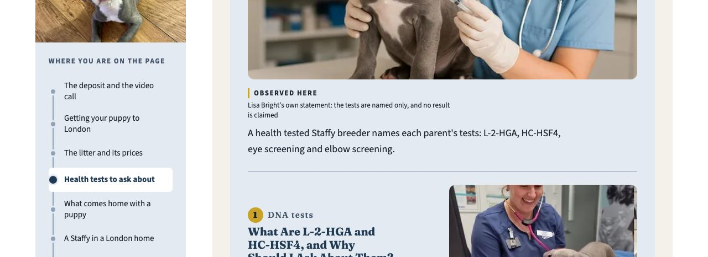

### #breed

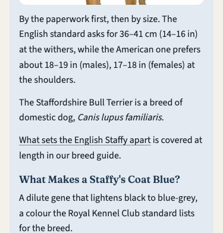
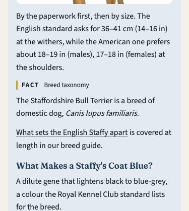
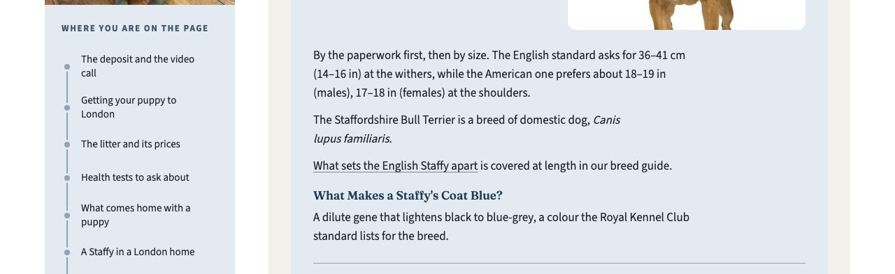
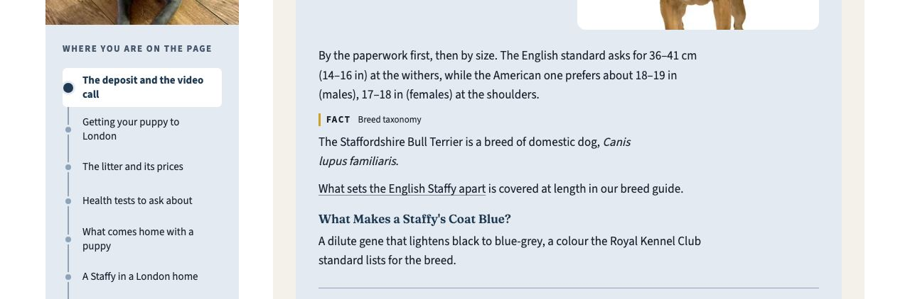

### #everyday-health

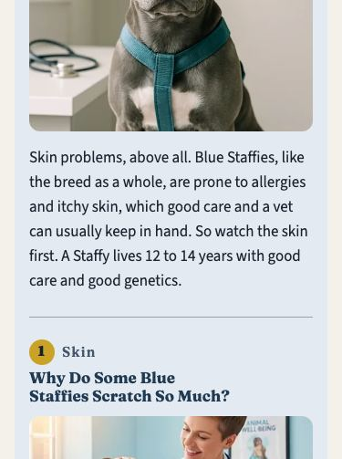
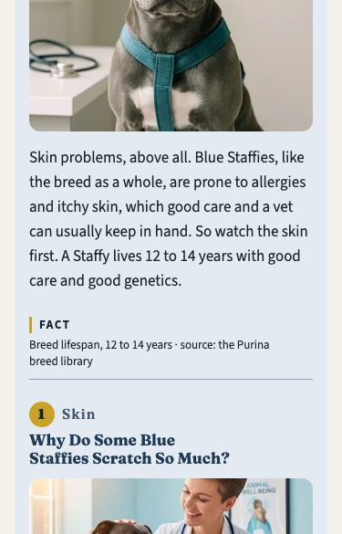
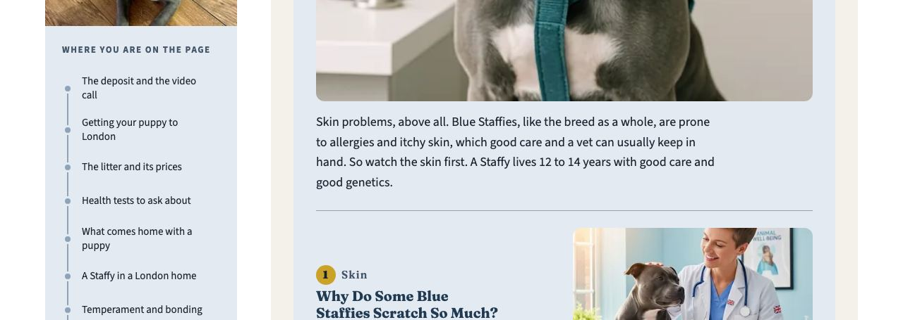
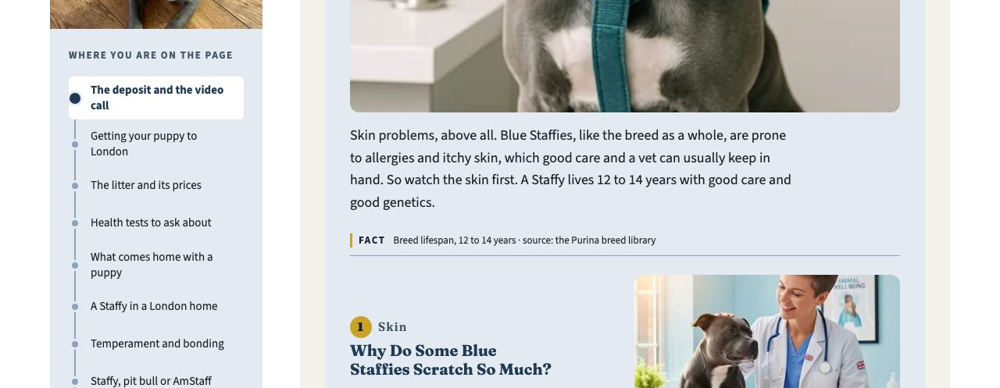

## q08 · The 21 Swaps

Seventeen sentences, **21 we/our/us** replaced. How they were chosen:

- London's own prose only. Real review text is never edited, and neither are the puppy cards' lines or the settings lines other pages share.
- No link anchor text: the anchors are on the approved board (rule 12). No headings: they are approved too.
- The first we/our/us in its section where the sentence allows, because that is where an AI reading a chunk cannot tell who "we" is.
- "Here at BlueStaffyUK" (working rule 1's own phrase) twice and "BlueStaffyUK" twice, so the brand term goes from 5 to 9 against its ceiling of 10. Every other swap names Lisa Bright.

| # | Section | Now | Proposed | Removed |
|---|---|---|---|---|
| 1 | #top | Your visit to us in Carlisle comes after that call. | Your visit to Lisa Bright in Carlisle comes after that call. | 1 |
| 2 | #top | We raise every litter in our own home, and our blue Staffy puppies | Here at BlueStaffyUK, every litter is raised in our own home, and our blue Staffy puppies | 1 |
| 3 | #trust | Each line is something you can check with us before you pay. | Each line is something you can check with Lisa Bright before you pay. | 1 |
| 4 | #key-takeaways | Ask any breeder, us included, about L-2-HGA | Ask any breeder, BlueStaffyUK included, about L-2-HGA | 1 |
| 5 | #deposit-viewing | Yes. Ask us for a live video call and we show you your puppy and Maggie together, at home, before you decide anything. | Yes. Ask Lisa Bright for a live video call and she shows you your puppy and Maggie together, at home, before you decide anything. | 2 |
| 6 | #delivery | Our staffie puppies in London homes all start here in Carlisle, then travel to your door by DEFRA-approved transport, or you collect them from us. | BlueStaffyUK's staffie puppies in London homes all start here in Carlisle, then travel to your door by DEFRA-approved transport, or you collect them from Lisa Bright. | 2 |
| 7 | #delivery | We have delivered to Croydon, Edmonton and Ilford before. | Puppies from Lisa Bright have gone to Croydon, Edmonton and Ilford before. | 1 |
| 8 | #litter-prices | Maggie is our dam and Jones our sire, both our own dogs. | Maggie is Lisa Bright's dam and Jones her sire, both our own dogs. | 2 |
| 9 | #litter-prices | so tell us which one you like and we confirm it is still free. | so tell Lisa Bright which one you like and we confirm it is still free. | 1 |
| 10 | #faq-middle | Ask us about L-2-HGA, HC-HSF4, eye screening and elbow screening for Maggie and Jones. | Ask Lisa Bright about L-2-HGA, HC-HSF4, eye screening and elbow screening for Maggie and Jones. | 1 |
| 11 | #faq-middle | Yes. Write to us before or after your puppy is home | Yes. Write to Lisa Bright before or after your puppy is home | 1 |
| 12 | #health-tests | With us, a live video call with your puppy and Maggie comes first, Maggie and Jones live with us, nothing is paid before that call | Here at BlueStaffyUK, a live video call with your puppy and Maggie comes first, Maggie and Jones live with Lisa Bright, nothing is paid before that call | 2 |
| 13 | #paperwork | is how we sell every litter. | is how Lisa Bright sells every litter. | 1 |
| 14 | #london-life | We don't name a London practice ourselves. | Lisa Bright names no London practice herself. | 1 |
| 15 | #newsletter | Leave your email and we write when our next litter is on the way. | Leave your email and Lisa Bright writes when our next litter is on the way. | 1 |
| 16 | #breed | is covered at length in our breed guide. | is covered at length in Lisa Bright's breed guide. | 1 |
| 17 | #enquiry | We reply by email, and you can ask for the video call before any deposit. | Lisa Bright replies by email, and you can ask for the video call before any deposit. | 1 |

**Measured on a copy of the built page:** the swaps alone take we/our/us from 141 to 120 over 6,036 words, a ratio of 0.0199 against the 0.0200 limit, so the pronoun WARN clears. The margin is one pronoun: a single new "we" elsewhere would bring it back. Named entities go from 66 to 81, with Lisa Bright from 1 to 16. With the FAQ set as well, the ratio is 0.0189, because the new answers were written with fewer pronouns. With the labels too, it is 0.0186. Duplicate checks, final audit and outline provenance are unchanged by the swaps alone.

**Voice.** 120 we/our/us stay on the page. The swaps put Lisa Bright's name where a reader is told to ask, write or visit, so the page still speaks as the breeder.

## Applied Today

- **q07 · `07229fcf`.** The binomial sentence opens chapter 1 of #breed, with `<i lang="la">`. `board_revisions` 29 records it, and the board was re-approved with `--reapprove` citing the rulings file. AEO binomial 0 → 1. Side effects: Staffordshire Bull Terrier 9 → 10, and #breed joins the statement-label sections.
- **q03 · `39ebabb0`.** `budgets_by_slug["uk-locations/blue-staffy-puppies-london"]` holds the five over-ceiling terms at their counts as built. Its `_why` cites q03, the rulings file and the approved board, with the per-term breakdown. Known Issue 99 calibrates `budgets.location` before the next city. `tests/py/test_evidence_london_budget.py` has 6 tests, including the ratchet (one more "London" fails) and a check that Leeds keeps the default. Evidence ERRORs on London: 5 → 0.
- **q04 · `86a7cc45`.** `claim_binding()` skips a row's repeats only when the row is `naming_only` with a `repeat_ruling` whose files exist, and no repeating sentence states a result: a result word anywhere in it, or the `dna-clear` vocabulary. `tests-named-no-result` carries both rulings (2026-09-29 q01, 2026-10-05 q04). `parents-dna-clear` is unchanged. `tests/py/test_evidence_naming_only_repeat.py` has 13 tests; 10 fail on the previous script, and the 3 that pass are the "still warns" direction. Evidence WARNs on London: 8 → 7, all statement labels.

## How This Was Measured

A simulation root held a copied `scripts/` and `dist/`, with everything else linked. Each proposal was written into London's built HTML and the audits ran there: `dup_content_audit.py` (body and `--headers`, over all 51 pages), `aeo_audit.py --fail-on-error`, `evidence_audit.py --type location --fail-on-error`, `page_hardening_scan.py`, `final_page_audit.py --type location` and `outline_provenance_check.py`. Screenshots and contrast come from Playwright's Chromium at 375 and 1280, with every FAQ answer opened. The repository's `dist/` and `src/` were not touched for any proposal.
